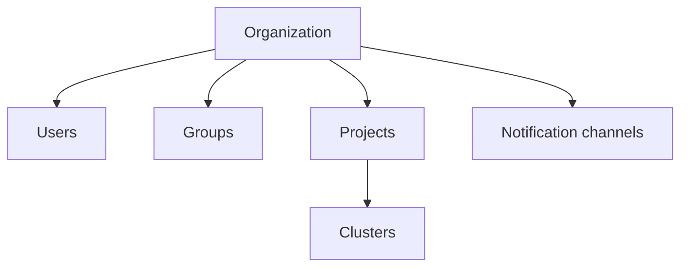
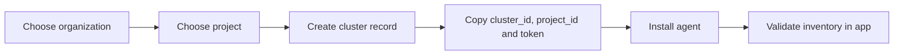

# Administration

The Admin Console is where Arguz defines tenancy, access and shared operational resources before the main app consumes them.

This page documents the behavior behind:

- `https://app-admin.arguz.io/admin/organizations`
- `https://app-admin.arguz.io/admin/organizations/<organization-id>/users`
- `https://app-admin.arguz.io/admin/organizations/<organization-id>/groups`
- `https://app-admin.arguz.io/admin/projects`
- `https://app-admin.arguz.io/admin/clusters`

## Administrative hierarchy

## Organizations

An organization is the tenant boundary for:

- ownership
- memberships
- direct and group roles
- projects
- clusters
- notification channels
- billing association
- Azure AD configuration

### Organization fields

The Admin Console supports organization-level fields such as:

- name
- slug
- owner email
- admin emails
- primary domain
- additional domains
- Azure AD enabled state
- Azure tenant ID
- Azure client ID
- Azure client secret
- Azure authority host

### Billing relationship

Organizations are linked to billing subscriptions before project and cluster growth can proceed safely. In practice:

- a subscription must be assigned to the organization
- project creation and cluster onboarding depend on that administrative foundation

## Projects

Projects belong to a single organization and are the grouping layer above clusters.

Projects are typically used to represent:

- a team
- an environment
- a business domain
- an operational boundary

Each project has at least:

- project name
- owner
- organization association

Clusters are then attached below the project.

## Clusters in Admin

The Admin cluster page controls cluster registration and lifecycle. It is responsible for:

- creating the cluster record
- binding the cluster to a project
- generating bootstrap credentials
- rotating the cluster token
- deleting the cluster record

### Cluster onboarding flow

### Cluster token rotation

Only elevated organization access should perform token rotation because:

- the previous token becomes invalid
- every running agent must be updated
- a mistaken rotation can interrupt discovery for the cluster

## Users

The organization users page shows the full access composition of a person:

- baseline organization membership
- owner state when applicable
- direct roles
- inherited roles from groups
- group memberships

### Membership roles

Arguz supports the following organization membership roles:

- `viewer`
- `editor`
- `admin`

These are baseline relationships, not the entire authorization model.

### What membership means operationally

- `viewer` is the minimum membership role
- `viewer` follows least-privilege by default
- `viewer` can list organizations by default
- `viewer` only gains additional access when an admin assigns direct or group-based permissions
- `editor` can manage editable organization resources
- `admin` can manage organization-wide resources
- `organization.owner` is separate and has full control

## Groups

Groups are the scalable way to grant shared access to teams.

A group can have:

- a name
- a description
- members
- assigned roles

Any role assigned to the group is inherited by every member of that group.

Use groups when:

- several people need the same access
- you want access to follow team membership
- you want fewer direct user exceptions

## Permission types

Arguz combines several permission sources:

- ownership
- organization membership
- direct user roles
- group-inherited roles

Direct and group roles can represent feature-specific permissions such as:

- revision and manifest viewing
- error and RCA access
- alert policy management
- event notification policy management
- cluster and project administration

In other words, a user may have baseline `viewer` membership and still gain additional capabilities only through direct or inherited roles granted by an administrator.

## Notification channels

Notification channels are organization-owned resources created in Admin and consumed in the main app.

Current channel types:

- Slack
- Microsoft Teams
- VictorOps

Channels are where teams define the actual webhook destination. Policies later decide when those channels are used.

## Recommended administrative operating order

1. Create the organization.
2. Assign billing.
3. Set the owner, admins, domains and slug.
4. Configure Azure AD if required.
5. Add users and groups.
6. Create projects.
7. Register clusters.
8. Create notification channels.
9. Move into policy and runtime operations from the main app.
