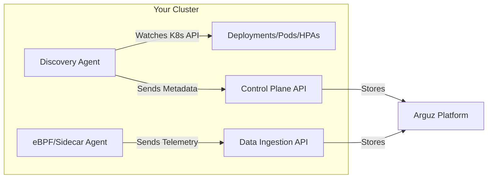

# Arguz Agent

The Arguz Agent is the component you install in your Kubernetes clusters to connect them to the Arguz platform. This section covers everything you need to know about the agent.

## In This Section

- **[Agent Overview](overview.md)** — What the agent does and how it helps your workflows
- **[Data Collection](data-collection.md)** — What data the agent captures and how
- **[Communication Protocols](protocols.md)** — How the agent communicates with the Arguz platform
- **[Required Permissions](permissions.md)** — Kubernetes RBAC needed by the agent
- **[Agent Security](security.md)** — Security model, authentication, and privacy considerations
- **[Limitations & Scope](limitations.md)** — What the agent does NOT capture or do

## Agent Types

Arguz currently provides one agent component:

| Agent | Purpose | Installation |
|---|---|---|
| **Discovery Agent** | Deployment tracking, cluster metadata, HPA monitoring, node snapshots | Helm chart |

Additional observability agents (eBPF-based or sidecar) for capturing application-level telemetry (HTTP events, database queries, logs, metrics) are available separately.

## High-Level Flow

