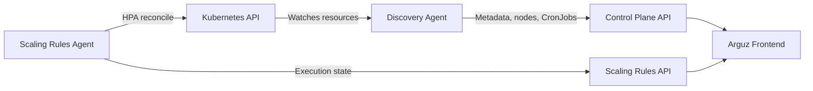

# Arguz Agent

The Arguz agent bundle is the in-cluster component set used by Arguz. Today the public Helm chart installs:

- **Discovery Agent**
- **Scaling Rules Agent**

These docs focus on the behavior that is currently exposed through the product and maintained in the agent chart.

## Responsibilities

### Discovery Agent

- Detect Deployment changes and create revisions
- Discover namespaces, services, jobs and ingress resources
- Capture HPA configuration snapshots
- Capture cluster cloud metadata
- Send node inventory snapshots
- Sync CronJob definitions and Job executions
- Persist the last 100 log lines for failed CronJob executions
- Send deployment metadata to the platform

### Scaling Rules Agent

- Applies temporary HPA changes from scaling templates
- Tracks rollback state
- Restores previous HPA values when templates expire or are disabled

## High-level flow

## Documentation map

| Page | What you'll find |
|---|---|
| [Agent Overview](overview.md) | Lifecycle, heartbeats, leader election and inventory loops |
| [Data Collection](data-collection.md) | Detailed list of cluster, node, CronJob and revision data |
| [Communication Protocols](protocols.md) | Endpoints, auth model and sync patterns |
| [Required Permissions](permissions.md) | Kubernetes RBAC required to run the agents |
| [Security Model](security.md) | Token handling, manifest sanitization and scope boundaries |
| [Limitations & Scope](limitations.md) | Best-effort metadata and what the agents do not measure |
