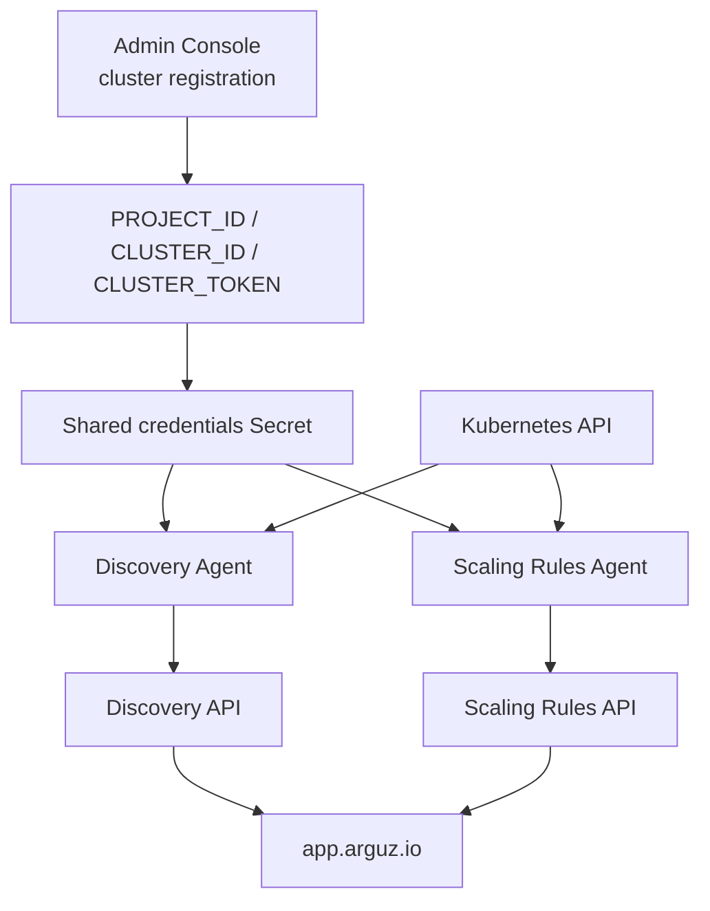

# Arguz Agent Bundle

The Arguz agent bundle is the supported in-cluster package used to connect a Kubernetes cluster with Arguz. The current public chart installs exactly two agents:

- **Discovery Agent**
- **Scaling Rules Agent**

Public resources:

- [Arguz Agent chart repository](https://github.com/Arguz-Labs/Arguz-Agent-Chart)
- [Public Helm repository](https://Arguz-Labs.github.io/Arguz-Agent-Chart)

## Current agents at a glance

| Agent | Primary responsibility | Reads from the cluster | Writes to the cluster | Sends to Arguz |
|---|---|---|---|---|
| Discovery Agent | Inventory, topology, revisions, CronJobs, node and cluster metadata | Namespaces, nodes, pods, services, ConfigMaps, Secrets, Deployments, ReplicaSets, HPAs, Jobs, CronJobs, Ingresses, NetworkPolicies, selected RBAC objects | No workload mutations. Only leader-election `Lease` updates | Inventory, revisions, errors, CronJobs, CronJob executions, node snapshots, cluster metadata |
| Scaling Rules Agent | Temporary scaling execution through HPAs | Pods, Deployments and HPAs, plus active templates from Arguz | Creates, updates or deletes managed HPAs and may update Deployment replica counts during apply or revert | Template execution and revert events |

## How the bundle fits into the platform

## Lifecycle after installation

1. A cluster is registered in the Admin Console and receives `PROJECT_ID`, `CLUSTER_ID` and `CLUSTER_TOKEN`.
2. The Helm chart stores those values in a shared Kubernetes Secret and deploys both agents in the `arguz-agent` namespace.
3. The Discovery Agent performs a warm-up sync for namespaces, Deployments and CronJobs before switching to informer-based monitoring and periodic heartbeats.
4. The Discovery Agent keeps Arguz updated with revisions, images, HPA snapshots, CronJob execution history, node snapshots and cluster metadata.
5. The Scaling Rules Agent reconciles every 30 seconds, fetches the templates that belong to the cluster, evaluates whether they should run now, then loads their actions.
6. Active scaling actions are applied in `priority_up` order. If a target Deployment has no HPA, the agent can create a provisional managed HPA first.
7. Managed HPAs are reverted in `priority_down` order when the execution window ends or when the template is disabled before its window expires.

## Operational model

- The public chart defaults to two Discovery Agent replicas and one Scaling Rules Agent replica.
- Discovery uses leader election so only one replica performs write-side sync operations at a time.
- Both agents reuse the same cluster-scoped credentials Secret.
- The Scaling Rules Agent can be disabled if the cluster should remain inventory-only.

## Documentation map

| Page | What it covers |
|---|---|
| [Agent Overview](overview.md) | Runtime lifecycle of both current agents and their decision model |
| [Data Collection](data-collection.md) | What leaves the cluster, how it is derived and what is stored as execution evidence |
| [Communication Protocols](protocols.md) | Credentials, API flows, polling cadence and request patterns |
| [Required Permissions](permissions.md) | RBAC scope required by each agent |
| [Security Model](security.md) | Secret handling, sanitization, ownership boundaries and rollback safety |
| [Limitations & Scope](limitations.md) | Intended limits, best-effort behavior and what the bundle does not do |
