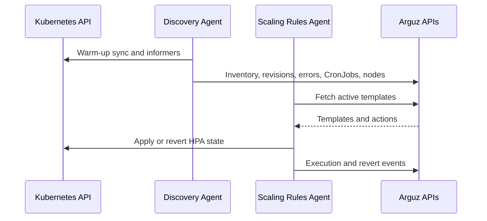

# Current Agents Overview

The current Arguz chart ships two different controllers with different responsibilities. One is read-heavy and inventory-oriented. The other is execution-oriented and only mutates scaling-related resources when a template is active.

## Discovery Agent

The Discovery Agent is a long-running Kubernetes controller built for cluster awareness and change detection. It does not proxy traffic and it does not mutate workloads.

### Startup sequence

1. Load cluster credentials and API base URL.
2. Start leader election in the `arguz-agent` namespace when running in-cluster.
3. Warm the baseline by syncing namespaces, Deployments and CronJobs.
4. Start steady-state loops and informers.

### Steady-state behavior

| Component | What it does |
|---|---|
| Heartbeat loop | Marks the cluster as connected and refreshes basic health |
| Cluster metadata loop | Refreshes provider, region, zone, cluster name and Kubernetes version |
| Node snapshot loop | Captures node capacity, allocatable values, runtime and conditions |
| Deployment and revision sync | Tracks Deployments, images, revisions and HPA relationships |
| CronJob sync | Tracks CronJob definitions and Job execution history |
| Informers | React to live changes for Deployments, Pods, Jobs, CronJobs, HPAs, Services, Helm Secrets, Ingresses, NetworkPolicies and selected RBAC resources |

### What it produces in Arguz

- namespace inventory
- Deployment inventory
- image inventory
- revision history
- deployment error signals
- HPA snapshots associated with workloads
- CronJob definitions
- CronJob execution history
- node snapshots
- cluster metadata

### Revision model

For workload changes, the agent creates revision records that help Arguz explain what changed and when. When the workload is Helm-managed, the agent derives Helm-aware revision context from release Secrets and sends a sanitized release representation instead of raw secret contents.

## Scaling Rules Agent

The Scaling Rules Agent is a reconciliation loop dedicated to temporary scaling changes. Its scope is limited to HPAs and the Deployment replica counts needed to make those HPA changes effective.

### Reconcile cycle

The agent runs a reconcile loop every 30 seconds:

1. Fetch the cluster templates from the Scaling Rules API.
2. Evaluate which templates should run now.
3. For each active template, fetch the template actions for that cluster.
4. Sort actions by `priority_up`.
5. Apply each action to the target Deployment and HPA.
6. Scan managed HPAs and revert the ones that expired or belong to a template that is no longer active.

### Template evaluation

The agent supports two execution paths:

- **Manual execution** takes precedence when the backend marks a template execution as `running`.
- **Scheduled execution** evaluates the template cron expression in the template timezone and derives the active execution window from the last scheduled run plus the configured duration.

The agent will not execute a scheduled template when:

- the template is disabled
- the template is past `valid_until`
- the current time is outside the active execution window

### Apply behavior

When an action becomes active:

1. The agent loads the target Deployment to determine the current replica baseline.
2. It looks for an HPA that already targets that Deployment.
3. If no HPA exists, it creates a provisional managed HPA first.
4. It stores the original HPA spec and original Deployment replica count as annotations on the managed HPA.
5. It applies the requested min and max replica overrides.
6. If needed, it raises Deployment replicas immediately so the requested minimum can be satisfied.
7. It posts an execution event back to the Scaling Rules API.

### Conflict and idempotency guards

- A managed HPA cannot be taken over by a different template or action while another managed execution is active.
- Repeated reconciliations of the same template and action are treated as idempotent unless the expected managed hash changes.

### Revert behavior

Reverts happen in `priority_down` order and are triggered for two reasons:

- the execution window expired
- the template was disabled and is no longer active for the cluster

If the agent created a provisional HPA, it restores the original Deployment replica count and deletes that HPA during revert. If the HPA existed before Arguz touched it, the agent restores the original HPA spec and removes the management annotations.

## Bundle interaction model

## Why the bundle is split this way

- Discovery remains mostly read-only and can keep syncing even when no scaling automation is enabled.
- Scaling logic stays isolated around HPA ownership, rollback and execution windows.
- The split makes permission scoping clearer: cluster discovery on one side, controlled scaling mutation on the other.
