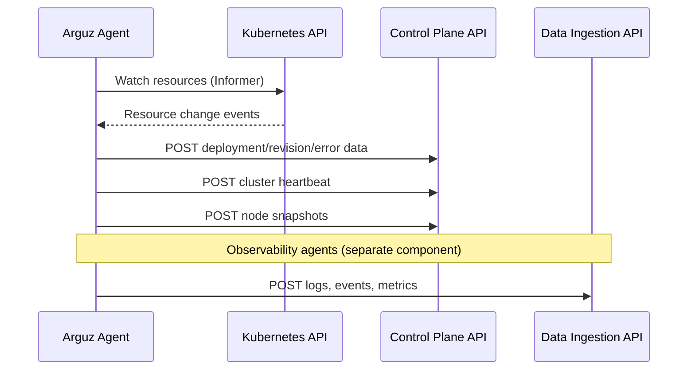

# Communication Protocols

This document explains how the Arguz Agent communicates with the Arguz platform, including protocols, ports, authentication, and network requirements.

## Communication Flow



## Endpoints

| API | Hostname | Purpose | Authentication |
|---|---|---|---|
| Control Plane API | `api-discover.arguz.io` | Deployment tracking, cluster management | `x-cluster-token` header |
| Data Ingestion API | `di-api.arguz.io` | Observability telemetry ingestion | `x-cluster-token` header |

## Protocol

All communication between the agent and the Arguz platform uses:

- **HTTPS** (TLS 1.2+) for encryption in transit
- **HTTP/1.1** for request/response
- **JSON** payloads for data formatting
- **POST** method for all data submission

## Authentication

The agent authenticates using a **Cluster Token** — a unique, pre-provisioned credential generated when you register your cluster in the Arguz web application.

The token is sent as an HTTP header:

```
x-cluster-token: <YOUR_CLUSTER_TOKEN>
```

### Token Lifecycle

- Tokens are generated during cluster registration in the Arguz web app
- Tokens can be rotated from the Clusters management page
- Tokens are stored securely in a Kubernetes Secret in your cluster
- Tokens are validated against the Arguz platform on every request

### Token Security

The Arguz platform validates tokens using **constant-time comparison** to prevent timing attacks. Tokens are cached for 60 seconds to balance security (fast revocation) with performance (avoiding a database lookup on every request).

## Network Requirements

### Outbound Connectivity

The agent requires **outbound HTTPS (port 443)** access to:

- `api-discover.arguz.io` — Control Plane API (deployment tracking, heartbeat, management)
- `di-api.arguz.io` — Data Ingestion API (logs, events, metrics — if using observability agents)

The agent does **not** require any inbound connectivity.

### Firewall Configuration

If your cluster has egress firewall rules, allow outbound HTTPS to:

```
api-discover.arguz.io
di-api.arguz.io
```

These hostnames resolve to load balancer IPs managed by the Arguz platform.

### Proxy Support

The agent supports HTTP proxies. Configure the standard environment variables:

```yaml
Discovery-Agent:
  env:
    HTTP_PROXY: "http://proxy.internal:8080"
    HTTPS_PROXY: "http://proxy.internal:8080"
    NO_PROXY: "kubernetes.default.svc,.cluster.local"
```

## Rate Limiting

The Arguz platform enforces per-cluster rate limiting to ensure fair usage and protect against misconfiguration:

- **Default limit**: 10,000 requests per 60-second window per cluster
- Exceeding the limit returns **HTTP 429 Too Many Requests**
- The agent implements exponential backoff when rate-limited

Under normal operation, the agent's request rate is well below these limits.

## Error Handling

The agent handles platform errors gracefully:

| HTTP Status | Agent Behavior |
|---|---|
| 200/201/202 | Success — data accepted |
| 401 Unauthorized | Log error — check cluster token |
| 402 Payment Required | Log warning — subscription issue |
| 429 Too Many Requests | Exponential backoff — retry |
| 503 Service Unavailable | Retry with `Retry-After` header |
| 5xx Server Error | Exponential backoff — retry |

## Data Compression

Where applicable, the agent compresses payloads to reduce bandwidth. The platform accepts standard HTTP compression (gzip).

## High Availability Communication

The agent's leader election ensures only the active leader sends data. If the leader pod fails:

1. A new leader is elected within ~10 seconds
2. The new leader begins watching Kubernetes resources
3. A full resync of current state occurs (to catch any missed events)
4. Normal data flow resumes

There is no data loss during leader transitions because the agent's informer cache is reconstructed from the Kubernetes API.

## Health Checks

The agent does not expose health check endpoints externally. The Arguz platform determines agent health based on:

- **Heartbeat interval**: The agent sends a heartbeat at regular intervals
- **Cluster status in dashboard**: Shows green (healthy), yellow (delayed), or red (disconnected)
- **Last seen timestamp**: Visible on the Clusters page in the web application

If an agent stops sending heartbeats beyond the configured threshold, the cluster status in the dashboard reflects the disconnection.
