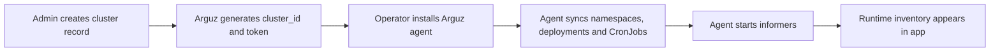

# Clusters & Nodes

The `Clusters` and `Nodes` screens explain where Arguz is collecting data from, how that data is grouped, and whether the runtime foundation of a project is healthy.

This page documents the behavior behind:

- `https://app.arguz.io/clusters`
- `https://app.arguz.io/nodes`
- `https://app-admin.arguz.io/admin/clusters`

## What a cluster means in Arguz

A cluster record is the bridge between the administrative model and live runtime discovery:

- a cluster belongs to exactly one project
- a project belongs to one organization
- namespaces, deployments, services and CronJobs are discovered under the cluster
- node snapshots are stored as operational inventory for the cluster

## Cluster onboarding flow

## What happens during registration

1. In the Admin Console, the operator selects the target organization and project.
2. A cluster record is created with a human-readable name and optional description.
3. Arguz generates the bootstrap credentials used by the agent.
4. The agent is installed in the cluster.
5. The first synchronization sends the current namespace, deployment and CronJob inventory.
6. Continuous informers then keep revisions, pod failures, HPA changes, services and CronJob executions up to date.

## What the `Clusters` page shows

The main app cluster page is the inventory and navigation layer for cluster-scoped operations. It is intended to answer:

- which clusters exist for the selected projects
- which provider and cloud metadata are available
- how many namespaces and deployments are currently tracked
- whether the cluster has enough context to build deep links into the cloud console

Typical cluster information includes:

- cluster name and description
- project membership
- cloud provider
- project, account or subscription metadata when available
- region and zone when available
- namespace count
- deployment count
- Kubernetes-related discovery context

## Cloud metadata and deep links

Arguz enriches clusters with provider metadata when it can safely infer it from the environment. This metadata is used to build cloud console links from revision and cluster views.

Arguz documents the resulting behavior, not the private collection heuristics:

- if provider metadata is available, Arguz can show links to cluster and workload views in the cloud console
- if provider metadata is incomplete, Arguz still tracks the cluster locally but some cloud links are absent
- cloud metadata is attached as operational context and does not replace the cluster record created in Admin

## What the `Nodes` page shows

The `Nodes` page is a cluster-scoped snapshot view that helps operators inspect capacity and readiness without opening the Kubernetes control plane.

Typical node data includes:

- node readiness
- cluster and project ownership
- zone or topology labels when present
- capacity and allocatable values for CPU, memory and pod count
- instance type and runtime identifiers when present
- Kubernetes version and kubelet context when present
- snapshot bucket timestamp showing when the inventory was captured

## How node data is used

The node screen is especially useful for:

- validating that a newly connected cluster is visible to Arguz
- checking whether runtime issues are localized to one cluster or node pool
- correlating deployment incidents with capacity pressure or readiness changes
- confirming which project and cluster a node belongs to before escalating

## Permissions and administrative boundaries

There are two different control planes involved:

- the main app allows cluster visibility and node review according to organization access and feature permissions
- the Admin Console controls cluster creation, token rotation and deletion

Operationally:

- owners and organization admins can register clusters and rotate cluster tokens
- project and cluster organization boundaries are enforced from the Admin side
- the main app focuses on observation, revision context and incident correlation

## Token rotation and lifecycle expectations

Cluster tokens are operational credentials for the agent connection.

- rotating a token invalidates the previous token
- all agents using the previous token must be updated after rotation
- deleting a cluster breaks the association for agents using that cluster token

Use token rotation when:

- a credential is suspected to be exposed
- a regular security rotation is required
- ownership of the cluster connection changes

## Recommended operating flow

1. Create the project first.
2. Register the cluster from Admin.
3. Install the agent with the generated credentials.
4. Confirm cluster visibility on `Clusters`.
5. Confirm node inventory on `Nodes`.
6. Only then move into deployment, service, CronJob and policy workflows.
