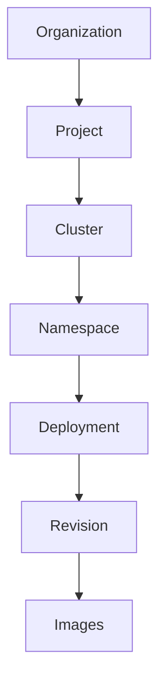
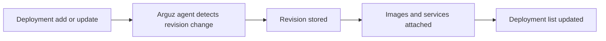

# Deployments & Images

Deployments are the change unit that powers Arguz correlation. Every rollout can become a revision, every revision carries image context, and every image can be searched across the organization.

This page documents the behavior behind:

- `https://app.arguz.io/deployments`
- `https://app.arguz.io/images`

For release history and revision detail, continue with [Revision History](../revisions/index.md).

## Deployment model

In Arguz, a deployment sits inside the runtime hierarchy shown below:

## What the `Deployments` page is for

The deployments screen is the operational index for rollout-bearing workloads. It is the fastest way to answer:

- which deployments exist in the selected organization scope
- what the most recent revision looks like
- which image set is currently associated with that deployment
- whether an HPA snapshot exists for the latest revision
- which cluster, namespace and project own the workload

## What Arguz stores per deployment view

The deployment list is enriched with data from the latest known revision:

- deployment name
- project, cluster and namespace
- latest revision number or version marker
- latest deployment timestamp
- revision type when available
- image names and tags from the latest revision
- HPA presence and current HPA snapshot when available
- cloud provider context and deep links when available

## How rollout data reaches this page

Arguz does not need a manual release note for this flow. The deployment change itself is the source event.

## Revision source patterns

Depending on the workload, the recorded revision may reflect:

- a regular deployment rollout
- a GitOps-driven rollout
- a Helm-derived revision context

The documentation intentionally focuses on what the operator sees:

- a new revision number
- rollout timestamps
- related images
- associated errors if failures begin after the rollout

## HPA visibility

For the latest revision of a deployment, Arguz can surface:

- whether HPA is present
- minimum replicas
- maximum replicas
- captured HPA metrics and behavior context when available
- capture timestamps for the HPA snapshot

This makes the deployment page the natural entry point before using [Scaling Rules](../policies/index.md).

## What the `Images` page is for

The images screen is a reverse index across the latest known workload states. It answers questions such as:

- where is this image tag running
- which services still use an older build
- which registry is serving the image
- how large is the blast radius of a vulnerable image

## Image fields commonly shown

- full image reference
- short image name
- tag
- container name
- deployment and service name
- revision number
- namespace, cluster and project
- deployed timestamp
- registry extracted from the image reference

## Typical operator workflows

### Validate a rollout

1. Open `Deployments`.
2. Filter by project, cluster, namespace or deployment.
3. Confirm the latest revision timestamp and image set.
4. Open the revision detail if the rollout needs deeper inspection.

### Assess blast radius for an image

1. Open `Images`.
2. Search by full image, short image name or tag.
3. Review all matching workloads across projects and clusters.
4. Use the revision number and deployment ownership to plan remediation.

### Prepare for scaling or rollback decisions

1. Open the deployment row.
2. Validate HPA context and the latest image set.
3. Compare with revision history.
4. Move into scaling rules or incident investigation as needed.

## Relationship with services

Deployments and services are related but not identical in Arguz:

- the deployment page is rollout-centered
- the service page is traffic and observability centered

If your main question is "what changed", start with deployments. If your main question is "how this service behaves in traffic, logs and dependencies", continue with [Workloads, Services & CronJobs](../workloads/index.md).
