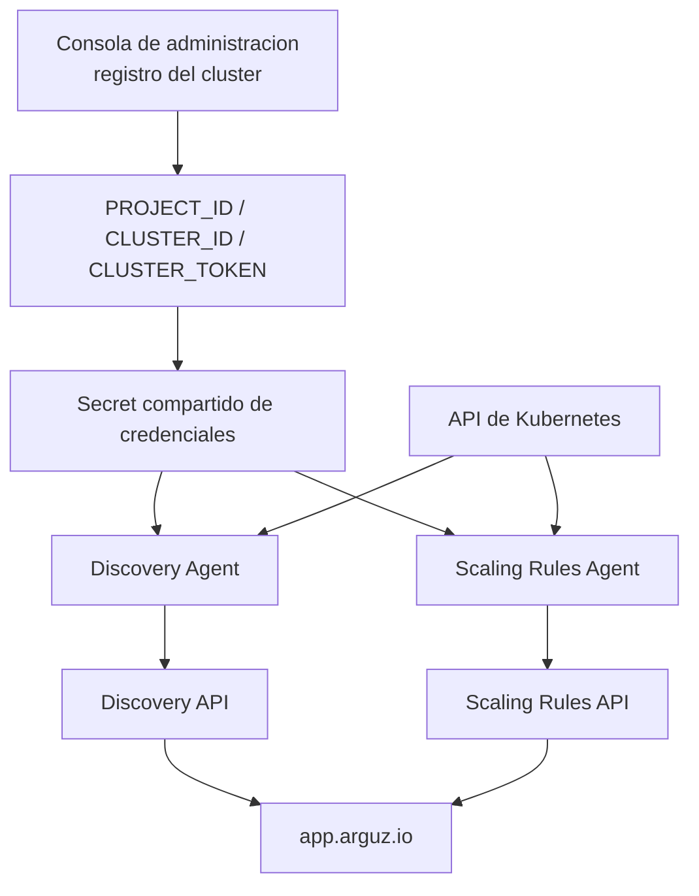

# Bundle de agentes de Arguz

El bundle de agentes de Arguz es el paquete in-cluster soportado para conectar un cluster de Kubernetes con Arguz. El chart publico actual instala exactamente dos agentes:

- **Discovery Agent**
- **Scaling Rules Agent**

Recursos publicos:

- [Repositorio del chart Arguz Agent](https://github.com/Arguz-Labs/Arguz-Agent-Chart)
- [Repositorio Helm publico](https://Arguz-Labs.github.io/Arguz-Agent-Chart)

## Agentes actuales de un vistazo

| Agente | Responsabilidad principal | Lee del cluster | Escribe en el cluster | Envia a Arguz |
|---|---|---|---|---|
| Discovery Agent | Inventario, topologia, revisiones, CronJobs, metadata de nodos y del cluster | Namespaces, nodes, pods, services, ConfigMaps, Secrets, Deployments, ReplicaSets, HPAs, Jobs, CronJobs, Ingresses, NetworkPolicies y algunos objetos RBAC | No muta workloads. Solo actualiza `Lease` de leader election | Inventario, revisiones, errores, CronJobs, ejecuciones de CronJob, snapshots de nodos y metadata del cluster |
| Scaling Rules Agent | Ejecucion de escalamiento temporal mediante HPA | Pods, Deployments y HPAs, mas los templates activos desde Arguz | Crea, actualiza o elimina HPAs administrados y puede actualizar replicas del Deployment durante apply o revert | Eventos de ejecucion y rollback |

## Como encaja el bundle en la plataforma

## Ciclo de vida despues de instalar

1. El cluster se registra en la Consola de administracion y recibe `PROJECT_ID`, `CLUSTER_ID` y `CLUSTER_TOKEN`.
2. El chart guarda esos valores en un Secret compartido y despliega ambos agentes en el namespace `arguz-agent`.
3. El Discovery Agent hace una sincronizacion inicial de namespaces, Deployments y CronJobs antes de pasar a monitoreo por informers y heartbeats periodicos.
4. El Discovery Agent mantiene actualizado a Arguz con revisiones, imagenes, snapshots de HPA, historial de CronJobs, snapshots de nodos y metadata del cluster.
5. El Scaling Rules Agent reconcilia cada 30 segundos, obtiene los templates del cluster, evalua cuales deben correr y luego carga sus acciones.
6. Las acciones activas se aplican en orden `priority_up`. Si el Deployment objetivo no tiene HPA, el agente puede crear primero un HPA provisional administrado.
7. Los HPAs administrados se revierten en orden `priority_down` cuando termina la ventana de ejecucion o cuando el template se deshabilita antes de terminarla.

## Modelo operativo

- El chart publico usa por defecto dos replicas de Discovery Agent y una replica de Scaling Rules Agent.
- Discovery usa leader election para que solo una replica ejecute las operaciones de sincronizacion que escriben en la plataforma al mismo tiempo.
- Ambos agentes reutilizan el mismo Secret de credenciales del cluster.
- El Scaling Rules Agent se puede deshabilitar si el cluster debe quedar solo en modo inventario.

## Mapa de documentacion

| Pagina | Que cubre |
|---|---|
| [Resumen de agentes](overview.md) | Ciclo de vida de los agentes actuales y su modelo de decision |
| [Recoleccion de datos](data-collection.md) | Que sale del cluster, como se deriva y que evidencia de ejecucion se guarda |
| [Protocolos de comunicacion](protocols.md) | Credenciales, flujos API, polling y patrones de request |
| [Permisos requeridos](permissions.md) | Alcance RBAC necesario por agente |
| [Modelo de seguridad](security.md) | Manejo de secretos, sanitizacion, ownership y seguridad del rollback |
| [Limites y alcance](limitations.md) | Limites intencionales, comportamiento best effort y lo que el bundle no hace |
