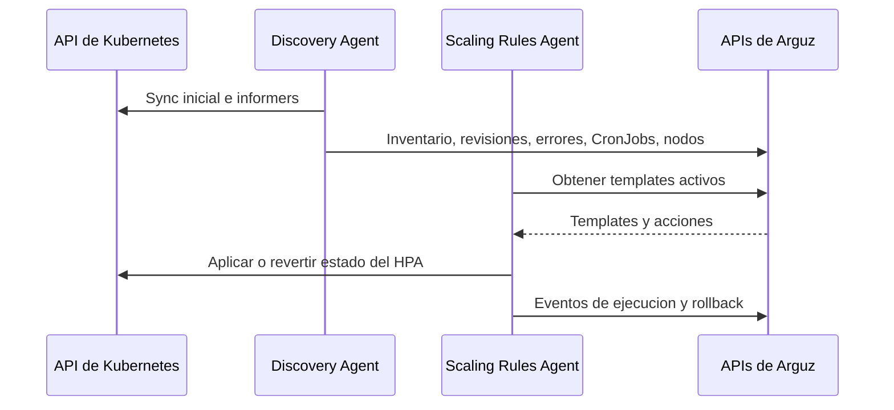

# Resumen de los agentes actuales

El chart actual de Arguz entrega dos controladores distintos con responsabilidades diferentes. Uno es intensivo en lectura y orientado a inventario. El otro esta orientado a ejecucion y solo muta recursos de escalamiento cuando un template esta activo.

## Discovery Agent

El Discovery Agent es un controlador de Kubernetes de larga duracion enfocado en awareness del cluster y deteccion de cambios. No proxya trafico y no muta workloads.

### Secuencia de arranque

1. Carga credenciales del cluster y la URL base de la API.
2. Inicia leader election en `arguz-agent` cuando corre dentro del cluster.
3. Calienta el baseline sincronizando namespaces, Deployments y CronJobs.
4. Inicia los loops e informers de estado estable.

### Comportamiento en estado estable

| Componente | Que hace |
|---|---|
| Loop de heartbeat | Marca el cluster como conectado y refresca salud basica |
| Loop de metadata del cluster | Refresca provider, region, zona, nombre del cluster y version de Kubernetes |
| Loop de snapshots de nodos | Captura capacidad, asignable, runtime y condiciones |
| Sync de Deployments y revisiones | Sigue Deployments, imagenes, revisiones y relaciones con HPA |
| Sync de CronJobs | Sigue definiciones de CronJob e historial de ejecucion de Jobs |
| Informers | Reaccionan a cambios en Deployments, Pods, Jobs, CronJobs, HPAs, Services, Helm Secrets, Ingresses, NetworkPolicies y algunos objetos RBAC |

### Lo que produce en Arguz

- inventario de namespaces
- inventario de Deployments
- inventario de imagenes
- historial de revisiones
- senales de error de deployments
- snapshots de HPA asociados a workloads
- definiciones de CronJobs
- historial de ejecuciones de CronJobs
- snapshots de nodos
- metadata del cluster

### Modelo de revisiones

Para cambios de workloads, el agente crea registros de revision que permiten a Arguz explicar que cambio y cuando. Cuando el workload esta gestionado por Helm, el agente deriva contexto de revision a partir de los Secrets del release y envia una representacion sanitizada en vez de los contenidos crudos del secreto.

## Scaling Rules Agent

El Scaling Rules Agent es un loop de reconciliacion dedicado a cambios temporales de escalamiento. Su alcance esta acotado a HPAs y a las replicas del Deployment necesarias para que esos cambios tengan efecto.

### Ciclo de reconciliacion

El agente ejecuta un reconcile cada 30 segundos:

1. Obtiene los templates del cluster desde la Scaling Rules API.
2. Evalua cuales deben ejecutarse en este momento.
3. Para cada template activo, obtiene las acciones del template para ese cluster.
4. Ordena las acciones por `priority_up`.
5. Aplica cada accion al Deployment y HPA objetivo.
6. Recorre los HPAs administrados y revierte los que expiraron o pertenecen a un template que ya no esta activo.

### Evaluacion de templates

El agente soporta dos caminos de ejecucion:

- **Ejecucion manual** tiene prioridad cuando el backend marca una ejecucion como `running`.
- **Ejecucion programada** evalua la expresion cron en la timezone del template y deriva la ventana activa a partir de la ultima ejecucion programada mas la duracion configurada.

El agente no ejecuta un template programado cuando:

- el template esta deshabilitado
- el template ya paso `valid_until`
- la hora actual esta fuera de la ventana activa

### Comportamiento de apply

Cuando una accion pasa a estado activo:

1. El agente carga el Deployment objetivo para conocer el baseline actual de replicas.
2. Busca un HPA que ya apunte a ese Deployment.
3. Si no existe HPA, crea primero un HPA provisional administrado.
4. Guarda como annotations el spec original del HPA y la cantidad original de replicas del Deployment.
5. Aplica los overrides de replicas minimas y maximas solicitados.
6. Si hace falta, sube inmediatamente las replicas del Deployment para cumplir el minimo pedido.
7. Publica un evento de ejecucion de vuelta a la Scaling Rules API.

### Guardas de conflicto e idempotencia

- Un HPA administrado no puede ser tomado por otro template o accion mientras exista otra ejecucion administrada activa.
- Las reconciliaciones repetidas del mismo template y accion se tratan como idempotentes salvo que cambie el hash esperado.

### Comportamiento de revert

Los revert se ejecutan en orden `priority_down` y se disparan por dos razones:

- expiro la ventana de ejecucion
- el template fue deshabilitado y ya no esta activo para el cluster

Si el agente creo un HPA provisional, restaura las replicas originales del Deployment y elimina ese HPA durante el revert. Si el HPA existia antes de que Arguz lo tocara, el agente restaura el spec original y elimina las annotations de administracion.

## Modelo de interaccion del bundle

## Por que el bundle esta separado asi

- Discovery puede seguir sincronizando aunque no haya automatizacion de scaling habilitada.
- La logica de scaling queda aislada alrededor de ownership de HPA, rollback y ventanas de ejecucion.
- La separacion hace mas claro el scope de permisos: discovery por un lado y mutacion controlada de scaling por el otro.
