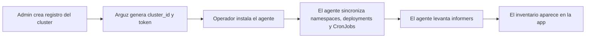

# Clusters y nodos

Las pantallas `Clusters` y `Nodes` explican desde donde esta recolectando datos Arguz, como se agrupan esos datos y si la base runtime de un proyecto esta sana.

Esta pagina documenta el comportamiento detras de:

- `https://app.arguz.io/clusters`
- `https://app.arguz.io/nodes`
- `https://app-admin.arguz.io/admin/clusters`

## Que significa un cluster en Arguz

El registro de cluster es el puente entre el modelo administrativo y el descubrimiento runtime:

- un cluster pertenece a un solo proyecto
- un proyecto pertenece a una organizacion
- namespaces, deployments, services y CronJobs se descubren bajo ese cluster
- los snapshots de nodos se almacenan como inventario operativo del cluster

## Flujo de onboarding del cluster

## Que ocurre durante el registro

1. En la Consola Admin, el operador selecciona la organizacion y el proyecto destino.
2. Se crea el registro del cluster con un nombre y una descripcion opcional.
3. Arguz genera las credenciales de bootstrap que usara el agente.
4. El agente se instala dentro del cluster.
5. La primera sincronizacion envia el inventario actual de namespaces, deployments y CronJobs.
6. Luego los informers continuos mantienen al dia revisiones, fallas de pods, cambios de HPA, services y ejecuciones de CronJobs.

## Que muestra la pagina `Clusters`

La pagina principal de clusters es la capa de inventario y navegacion para operaciones a nivel cluster. Esta pensada para responder:

- que clusters existen para los proyectos seleccionados
- que provider y metadata cloud estan disponibles
- cuantos namespaces y deployments estan siendo rastreados
- si el cluster tiene contexto suficiente para construir links a la consola cloud

La informacion tipica del cluster incluye:

- nombre y descripcion
- proyecto al que pertenece
- provider cloud
- metadata de proyecto, cuenta o suscripcion cuando existe
- region y zona cuando existe
- cantidad de namespaces
- cantidad de deployments
- contexto de descubrimiento Kubernetes

## Cloud metadata y deep links

Arguz enriquece los clusters con metadata del provider cuando puede inferirla de forma segura desde el entorno. Esa metadata se usa para construir links desde vistas de revisiones y clusters hacia la consola cloud.

Arguz documenta el comportamiento resultante, no las heuristicas privadas de captura:

- si la metadata del provider existe, Arguz puede mostrar links al cluster y al workload en la consola cloud
- si la metadata es incompleta, Arguz sigue rastreando el cluster localmente pero algunos links no aparecen
- la metadata cloud es contexto operativo y no reemplaza el registro administrativo del cluster

## Que muestra la pagina `Nodes`

La pagina `Nodes` es una vista snapshot por cluster que ayuda a revisar capacidad y readiness sin abrir directamente el control plane de Kubernetes.

Los datos tipicos por nodo incluyen:

- readiness del nodo
- pertenencia a cluster y proyecto
- labels de zona o topologia cuando existen
- capacidad y allocatable para CPU, memoria y pods
- tipo de instancia e identificadores de runtime cuando existen
- version de Kubernetes y kubelet cuando existen
- timestamp del bucket de captura

## Como se usa la data de nodos

La pantalla de nodos es especialmente util para:

- validar que un cluster nuevo ya es visible para Arguz
- revisar si un incidente runtime esta concentrado en un cluster o node pool
- correlacionar problemas de deployment con presion de capacidad o readiness
- confirmar a que proyecto y cluster pertenece un nodo antes de escalar

## Permisos y limites administrativos

Hay dos planos de control diferentes:

- la app principal permite visibilidad de clusters y revision de nodos segun acceso organizacional y permisos de funcionalidad
- la Consola Admin controla alta de clusters, rotacion de token y eliminacion

En terminos operativos:

- owners y organization admins pueden registrar clusters y rotar tokens
- los limites entre organizacion, proyecto y cluster se controlan desde Admin
- la app principal se enfoca en observacion, contexto de revision y correlacion de incidentes

## Rotacion de token y expectativas de ciclo de vida

Los tokens de cluster son credenciales operativas de conexion para el agente.

- rotar un token invalida el token anterior
- todos los agentes que usaban el token anterior deben actualizarse
- eliminar el cluster rompe la asociacion para los agentes que usaban ese token

Usa rotacion cuando:

- sospechas exposicion de la credencial
- tienes una politica regular de rotacion de seguridad
- cambia la responsabilidad operacional del cluster

## Flujo recomendado de operacion

1. Crea primero el proyecto.
2. Registra el cluster desde Admin.
3. Instala el agente con las credenciales generadas.
4. Confirma visibilidad en `Clusters`.
5. Confirma inventario de nodos en `Nodes`.
6. Recién despues avanza a deployments, services, CronJobs y politicas.
