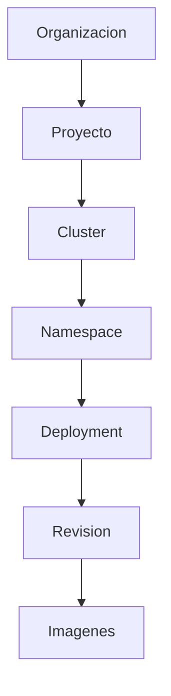
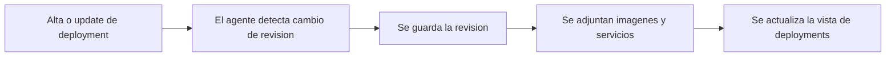

# Deployments e imagenes

Los deployments son la unidad de cambio que alimenta la correlacion de Arguz. Cada rollout puede convertirse en una revision, cada revision trae contexto de imagen y cada imagen puede buscarse a nivel de organizacion.

Esta pagina documenta el comportamiento detras de:

- `https://app.arguz.io/deployments`
- `https://app.arguz.io/images`

Para historial de releases y detalle de revisiones, continua con [Revisiones](../revisions/index.md).

## Modelo de deployment

En Arguz, un deployment vive dentro de la siguiente jerarquia runtime:

## Para que sirve la pagina `Deployments`

La pantalla de deployments es el indice operativo de workloads con historial de rollout. Sirve para responder:

- que deployments existen en el alcance seleccionado
- como se ve la revision mas reciente
- que set de imagenes esta asociado al deployment
- si existe un snapshot de HPA para la ultima revision
- que cluster, namespace y proyecto son dueños del workload

## Que guarda Arguz en la vista de deployment

El listado de deployments se enriquece con la informacion de la ultima revision conocida:

- nombre del deployment
- proyecto, cluster y namespace
- numero o version de la revision mas reciente
- timestamp del ultimo despliegue
- tipo de revision cuando existe
- nombres y tags de imagenes de la ultima revision
- presencia de HPA y snapshot HPA cuando existe
- contexto de provider cloud y deep links cuando existen

## Como llega el dato de rollout a esta pagina

Arguz no necesita una nota manual de release para este flujo. El cambio del deployment es el evento fuente.

## Patrones de origen de revision

Dependiendo del workload, la revision registrada puede reflejar:

- un rollout regular del deployment
- un rollout disparado por GitOps
- contexto de release derivado de Helm

La documentacion se enfoca en lo que ve el operador:

- un nuevo numero de revision
- timestamps del rollout
- imagenes relacionadas
- errores asociados si las fallas comienzan despues del cambio

## Visibilidad de HPA

Para la ultima revision de un deployment, Arguz puede mostrar:

- si existe HPA
- replicas minimas
- replicas maximas
- metricas y contexto del HPA cuando estan disponibles
- timestamps de captura del snapshot HPA

Por eso la pagina de deployments es una buena entrada antes de trabajar con [Scaling Rules](../policies/index.md).

## Para que sirve la pagina `Images`

La pantalla de imagenes es un indice inverso sobre el estado mas reciente de los workloads. Responde preguntas como:

- donde esta corriendo este tag de imagen
- que servicios siguen usando un build antiguo
- que registry sirve la imagen
- cual es el blast radius de una imagen vulnerable

## Campos tipicos en la pagina de imagenes

- referencia completa de imagen
- nombre corto de imagen
- tag
- nombre del contenedor
- deployment y service name
- numero de revision
- namespace, cluster y proyecto
- timestamp de despliegue
- registry extraido desde la referencia

## Flujos tipicos de operacion

### Validar un rollout

1. Abre `Deployments`.
2. Filtra por proyecto, cluster, namespace o deployment.
3. Confirma timestamp e imagenes de la ultima revision.
4. Abre el detalle de revision si necesitas mas profundidad.

### Medir el blast radius de una imagen

1. Abre `Images`.
2. Busca por imagen completa, nombre corto o tag.
3. Revisa todos los workloads que hacen match.
4. Usa el numero de revision y la propiedad del deployment para planificar la remediacion.

### Preparar una decision de scaling o rollback

1. Abre el deployment afectado.
2. Valida el contexto HPA y el set de imagenes.
3. Compara con el historial de revisiones.
4. Continua hacia scaling rules o investigacion de incidentes segun corresponda.

## Relacion con services

Deployments y services estan relacionados pero no son lo mismo en Arguz:

- la pagina de deployments esta orientada a cambios y rollouts
- la pagina de services esta orientada a trafico y observabilidad

Si tu pregunta principal es "que cambio", parte por deployments. Si tu pregunta es "como se comporta este servicio en logs, eventos, metricas y dependencias", continua con [Workloads, servicios y CronJobs](../workloads/index.md).
