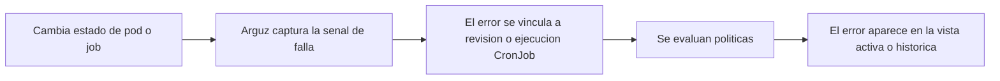
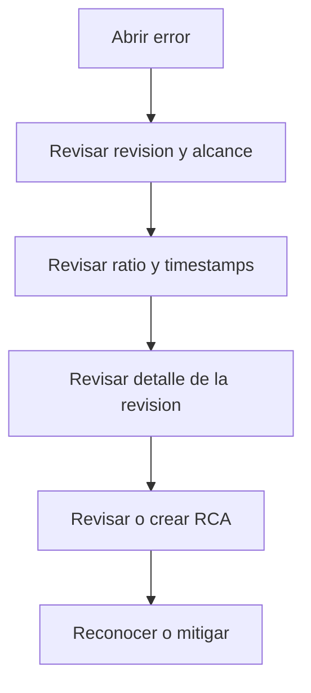

# Errores e incidentes

Arguz registra fallas runtime con contexto de workload y de rollout, de modo que la investigacion parte desde una revision y no desde un log aislado.

Esta pagina documenta el comportamiento detras de:

- `https://app.arguz.io/errors`
- `https://app.arguz.io/errors/history`

## Vista activa versus historica

- `Errors` es la cola operativa para issues actuales o recientes que aun requieren revision.
- `Errors History` agrega un rango de fechas mas amplio para postmortem, tendencias y auditoria.

Ambas paginas usan los mismos filtros jerarquicos:

- proyecto
- cluster
- namespace
- deployment

## Como un error se vuelve visible

## Familias de error capturadas actualmente

Arguz captura multiples condiciones de falla para revisiones de deployment, incluyendo:

- `CrashLoopBackOff`
- `ImagePullBackOff`
- `ErrImagePull`
- `ErrImageNeverPull`
- `CreateContainerConfigError`
- `CreateContainerError`
- `RunContainerError`
- `ContainerCannotRun`
- `InvalidImageName`
- `CreatePodSandboxError`
- `CreateContainerSandboxError`
- `NetworkPluginNotReady`
- `PodFailed`
- `OOMKilled`
- `Error`
- `DeadlineExceeded`
- `Failed`
- `Unknown`
- `Pending`
- `Evicted`
- `Unschedulable`
- `ContainersNotReady`
- `NotReady`
- `NotInitialized`
- `Restarts`
- variantes de init containers como `Init:CrashLoopBackOff` y `Init:OOMKilled`

Las fallas de CronJob se rastrean por separado mediante historial de ejecuciones y pueden incluir:

- estado del job
- exit code
- failure reason
- failure message
- extractos de logs cuando existen

## Que contiene un registro de error

Un error de revision puede incluir:

- tipo de error
- mensaje legible
- detalles estructurados
- severidad
- pods afectados
- total de pods
- ratio afectado
- momento de ocurrencia
- estado mitigado
- timestamp de mitigacion
- revision y alcance del workload relacionado

Por eso Arguz puede evaluar politicas por umbral y no limitarse a mandar todas las fallas iguales.

## Flujo de investigacion

## Diferencia entre acknowledge y mitigate

Estas acciones no son equivalentes:

- `Acknowledge` se usa cuando una alerta ya fue disparada y un operador esta tomando ownership
- `Mitigate` se usa cuando el equipo considera que el error ya fue tratado desde la perspectiva operativa de Arguz

En la practica:

- el acknowledge esta ligado a workflows de alerta
- la mitigacion afecta como se trata el issue en la revision operativa y en el seguimiento de politicas

## Flujo de RCA

La revision de errores en Arguz es consciente de la revision:

- el detalle del error puede cargar la revision relacionada
- la revision aporta contexto de rollout, imagenes, servicio y provider
- las notas RCA y los asistentes de analisis pueden adjuntarse cuando el permiso lo permite

El punto importante para el usuario es que el RCA parte desde hechos runtime capturados, no desde una pagina vacia.

## Como usan los errores las politicas

Las alert policies evalúan errores runtime usando:

- organizacion
- path y alcance
- tipo de error
- ratio afectado
- delay
- ventana de silencio
- estado enabled
- ventanas horarias UTC de los canales

Consulta [Politicas y gobernanza](../policies/index.md) y [Notificaciones](../notifications/index.md) para el comportamiento de entrega.

## Flujo recomendado de incidentes

1. Parte por `Errors` para la respuesta operativa activa.
2. Abre la revision relacionada antes de asumir la causa raiz.
3. Usa el ratio afectado para separar fallas localizadas de fallas amplias.
4. Revisa si una politica debio haber notificado al equipo correcto.
5. Usa `Errors History` para retrospectivas y patrones repetidos.
