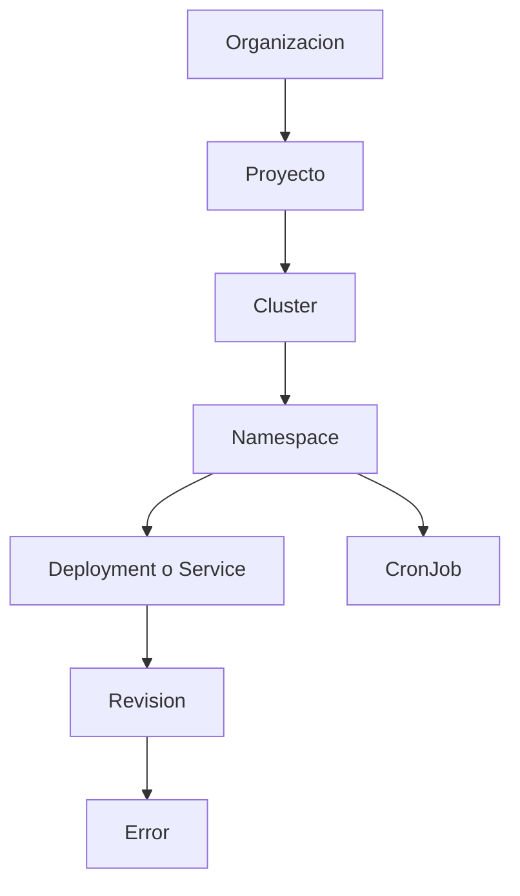
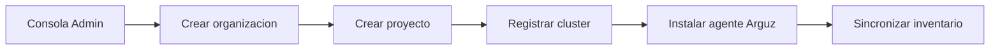
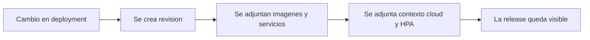
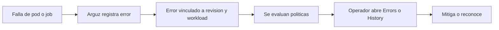
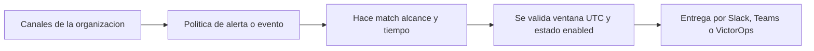

# Documentacion de Arguz

Arguz es una plataforma de operaciones para Kubernetes centrada en cinco trabajos conectados:

- modelar la jerarquia runtime del estate
- seguir cada rollout como una revision
- capturar fallas runtime con contexto de cambio
- enrutar notificaciones usando politicas reutilizables
- gobernar acceso, clusters y canales desde una sola capa administrativa

Esta documentacion esta escrita para que un operador pueda pasar desde el onboarding hasta la operacion diaria sin depender de conocimiento oculto del producto.

## Entradas por idioma

| Idioma | Punto de inicio |
|---|---|
| Espanol | [Introduccion y recorrido](getting-started/) |
| English | [English docs](../getting-started/) |

## Jerarquia de recursos

El modelo mental principal de Arguz es jerarquico. La mayoria de las pantallas, filtros y permisos siguen esta cadena:

## Que significa cada nivel

- `Organizacion` es el limite de tenant para usuarios, grupos, billing, canales, politicas y SSO.
- `Proyecto` agrupa clusters que pertenecen al mismo dominio de negocio, equipo o entorno.
- `Cluster` es el objetivo Kubernetes registrado y conectado por el agente de Arguz.
- `Namespace` delimita workloads dentro del cluster.
- `Deployment` es la unidad de cambio que Arguz correlaciona con revisiones y errores.
- `Service` es la vista orientada a trafico y observabilidad del workload.
- `Revision` es el snapshot inmutable creado por un rollout.
- `CronJob` es la unidad de ejecucion programada, separada del historial de revisiones.

## Flujos nucleares del producto

### 1. Dar de alta y descubrir

### 2. Seguir un rollout

### 3. Investigar un incidente

### 4. Notificar al canal correcto

## Modelo de acceso resumido

Arguz combina membresia base con roles finos:

- `organization.owner` tiene control total de la organizacion.
- Las membresias base son `guest`, `view`, `editor` y `admin`.
- Los roles directos a usuario pueden agregar permisos especificos por funcionalidad.
- Los roles heredados por grupo permiten compartir acceso sin editar usuario por usuario.
- Algunas pantallas ademas exigen permisos puntuales como ver revisiones, revisar RCA, editar politicas o administrar clusters.

El modelo completo esta documentado en [Administracion](administration/index.md) y [Azure AD](integrations/azure-ad.md).

## Mapa de documentacion

| Necesidad | Pagina |
|---|---|
| Entender releases, revisiones y contexto de rollout | [Revisiones](revisions/index.md) |
| Operar deployments e inventario de imagenes | [Deployments e imagenes](deployments/index.md) |
| Operar clusters y nodos | [Clusters y nodos](clusters/index.md) |
| Entender servicios, CronJobs e historial de ejecuciones | [Workloads, servicios y CronJobs](workloads/index.md) |
| Investigar fallas activas e historicas | [Errores e incidentes](incidents/index.md) |
| Configurar canales y entender la entrega | [Notificaciones](notifications/index.md) |
| Configurar alertas, eventos y automatizacion de scaling | [Politicas y gobernanza](policies/index.md) |
| Gestionar organizaciones, proyectos, usuarios, grupos y clusters | [Administracion](administration/index.md) |
| Configurar Microsoft Entra ID por organizacion | [Azure AD](integrations/azure-ad.md) |
