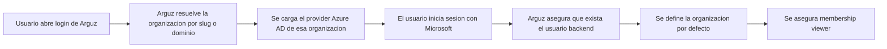

# Azure AD

Arguz soporta Microsoft Entra ID a nivel de organizacion. La integracion se configura en la Consola Admin y luego es usada tanto por la app principal como por la app administrativa.

## Para que sirve esta integracion

Usa Azure AD cuando necesitas:

- inicio de sesion Microsoft especifico por organizacion
- acceso corporativo guiado por dominio
- un punto de entrada SSO compartible basado en slug
- membresia base automatica para usuarios que ingresan por la organizacion configurada

## Donde se configura

Azure AD se configura dentro del registro de la organizacion en la Consola Admin.

Campos requeridos:

- slug de la organizacion
- Azure AD habilitado
- tenant ID
- client ID
- client secret

Campos opcionales pero importantes:

- primary domain
- domains adicionales
- authority host

## Modelo de resolucion para el inicio de sesion

Arguz primero necesita determinar a que organizacion quiere entrar el usuario.

Puede resolverlo desde:

- el slug de la organizacion
- el primary domain
- cualquiera de los domains adicionales configurados
- el dominio del email usado como hint durante el login

## Flujo de login con Azure AD

## Que ocurre despues de un login Microsoft exitoso

Cuando el login pertenece a una organizacion valida con Azure habilitado, Arguz:

- crea o reutiliza el usuario backend
- ajusta la organizacion por defecto de ese usuario si hace falta
- asegura al menos una membership `viewer` dentro de la organizacion

Esta es una regla operativa importante:

- el login Azure AD entrega membresia base en la organizacion
- esa membresia base es `viewer` y sigue minimo privilegio por defecto
- por defecto eso significa que el usuario puede listar organizaciones y solo expande acceso con permisos asignados por un admin
- no convierte automaticamente al usuario en admin, editor u owner
- los privilegios superiores siguen otorgandose por cambios de membership, roles directos o grupos

## Link de acceso basado en slug

Arguz puede generar un link compartible de ingreso especifico por organizacion usando el slug. Este es el punto de entrada recomendado para usuarios finales porque elimina ambiguedad sobre que configuracion debe usarse.

Usa el link con slug cuando:

- la misma empresa opera mas de una organizacion en Arguz
- quieres que el usuario aterrice directo en el tenant correcto
- no quieres depender solo de descubrimiento por dominio del email

## Campos de dominio y por que importan

- `primary_domain` identifica el dominio principal del negocio
- `domains` permite agregar dominios alternativos
- esos valores ayudan a Arguz a resolver la organizacion desde hints de login

Esto es especialmente util cuando los usuarios no comienzan desde el link con slug.

## Guia operativa

1. Define primero el slug de la organizacion.
2. Agrega el primary domain y cualquier dominio secundario.
3. Habilita Azure AD y completa tenant, client y secret.
4. Prueba la URL de login con slug.
5. Comparte esa URL con los usuarios finales.
6. Despues del primer ingreso, revisa si el usuario necesita solo `viewer` o permisos adicionales.

## Expectativas comunes

- una sola organizacion con Azure habilitado basta para activar ese flujo de ingreso
- la configuracion por organizacion es la que determina que provider Azure se usa al hacer login
- una cosa es que el login sea exitoso y otra el nivel de autorizacion dentro de Arguz

Si el login Microsoft funciona pero el usuario no puede gestionar recursos, normalmente el problema son permisos Arguz faltantes y no Azure AD.
