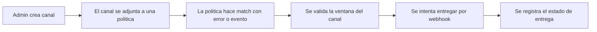

# Notificaciones

Arguz separa la entrega de notificaciones en dos capas:

- canales de notificacion propiedad de la organizacion
- politicas que deciden cuando esos canales se usan

Esta pagina documenta el comportamiento detras de:

- `https://app.arguz.io/event-notification-policies`
- la gestion de canales en `https://app-admin.arguz.io/admin/organizations/<organization-id>/notification-channels`

El matching especifico de alertas se describe en [Politicas y gobernanza](../policies/index.md).

## Tipos de canal soportados

Arguz soporta actualmente:

- Slack
- Microsoft Teams
- VictorOps

## Donde se crean los canales

Los canales se crean en la Consola Admin a nivel de organizacion. Un canal pertenece a una organizacion y luego puede adjuntarse a politicas dentro de la app principal.

Las configuraciones tipicas por tipo son:

- `Slack`: incoming webhook URL y un label de canal opcional
- `Microsoft Teams`: incoming webhook URL
- `VictorOps`: webhook URL

Cada canal tambien puede estar habilitado o deshabilitado globalmente.

## Modelo de entrega

## Ventanas y horarios por canal

Las politicas pueden definir ventanas activas por canal usando:

- dias activos
- hora de inicio en UTC
- hora de fin en UTC

Eso significa:

- el mismo canal puede estar activo para una politica y no para otra
- la evaluacion se hace contra ventanas UTC y no contra la hora local del navegador
- si no configuras horario, el canal se considera siempre elegible para esa politica

## Estado enabled y reintentos

Antes de entregar, Arguz revisa varias condiciones:

- la politica debe estar habilitada
- el canal debe estar habilitado
- la politica no debe estar silenciada para el tiempo evaluado
- el canal debe estar dentro de su ventana activa

Operativamente:

- si el canal no es elegible en ese momento, Arguz evita tratarlo como envio exitoso
- los envios de eventos guardan estado para permitir retry cuando corresponde
- los envios de alerta tambien guardan estado de procesamiento para evitar duplicados ciegos

## Estados de entrega que conviene entender

Arguz registra internamente el progreso de la entrega para que puedas razonar sobre que paso:

- `processing` significa que el envio esta en cola o en curso
- `alerted` significa que el envio fue entregado
- los flujos de alertas tambien pueden pasar por estados como `resolved` o `acknowledged`

La UI exacta puede variar segun la pantalla, pero el significado operativo es el mismo.

## Que se entrega

Existen dos familias distintas de notificacion:

- `Alert notifications` guiadas por errores runtime y alert policies
- `Event notifications` guiadas por eventos de ciclo de vida

La familia de eventos hoy incluye al menos:

- `deployment.revision.created`

Eso significa que Arguz puede notificar a un equipo cuando se crea una nueva revision incluso si todavia no existe una falla.

## Que contiene una notificacion

Segun el canal y el tipo de politica, la entrega puede incluir:

- contexto de proyecto, cluster, namespace y servicio
- numero de revision
- nombre de la politica que hizo match
- affected ratio en el caso de alertas
- path del evento en notificaciones de revision creada
- links de retorno a Arguz para RCA o revision

## Patron practico de operacion

1. Crea los canales una sola vez en Admin.
2. Nombralos por equipo o por proposito de escalamiento.
3. Usa horarios por politica en vez de duplicar canales para turnos.
4. Prefiere deshabilitar un canal antes que borrarlo si necesitas una pausa temporal.
5. Valida las notificaciones junto con el diseno de alcance, no como una configuracion aislada.
