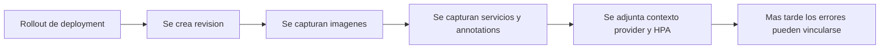
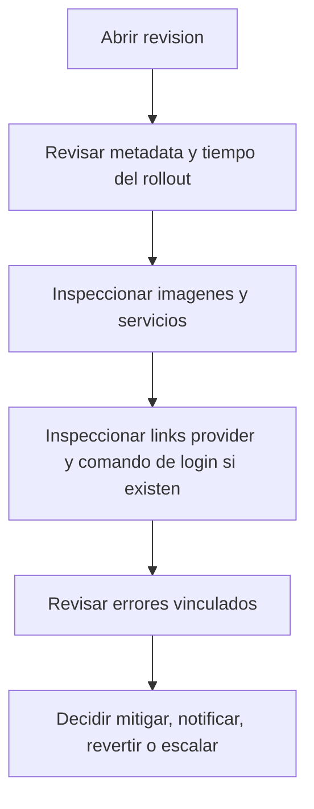

# Revisiones

La experiencia de `Releases` en Arguz esta construida sobre revisiones. Una revision es el checkpoint operativo inmutable creado para un rollout de deployment.

Esta pagina documenta el comportamiento detras de:

- `https://app.arguz.io/releases`

## Por que existen las revisiones

Las revisiones permiten responder rapido la pregunta mas dificil de la operacion diaria:

> Este problema comenzo porque el workload cambio, o comenzo mientras el workload seguia igual?

Arguz resuelve eso adjuntando fallas, imagenes, contexto cloud y estado HPA a un registro concreto de rollout.

## Ciclo de vida de una revision

## Que contiene una revision

Una revision puede incluir:

- identificador y numero de revision
- identificador del deployment y service name
- contexto de namespace, cluster y proyecto
- timestamps de creacion y actualizacion
- estado
- reviewer o actor cuando existe
- notas del rollout cuando existen
- deployment annotations y pod annotations
- imagenes usadas por la revision
- referencias de servicios detectados
- snapshot HPA cuando existe
- metadata cloud y links al provider cuando existen
- errores runtime vinculados

## Para que sirve la pagina `Releases`

La pagina de releases es el listado filtrable del historial de revisiones dentro del alcance seleccionado. Ayuda a:

- revisar rollouts recientes
- acotar el blast radius de un cambio riesgoso
- comparar un deployment con otros cambios recientes
- saltar desde una revision hacia imagenes, services, clusters o errores

## Flujo de detalle de revision

Cuando un operador abre una revision, la idea es pasar de un rollout generico a un diagnostico accionable:

## Contexto del provider dentro de la revision

Si existe metadata cloud para el cluster, el detalle de revision puede exponer:

- badge del provider
- links al cluster y al namespace
- links al workload
- links a YAML o detalles cuando el provider lo soporta
- un comando de login para llegar al cluster

Estas son ayudas operativas. La revision sigue siendo valida aunque falten links cloud.

## Contexto de imagenes y servicios dentro de una revision

El detalle de revision es donde el contexto de cambio se vuelve explicito:

- el set actual de imagenes muestra exactamente que se desplego
- los sets anteriores permiten identificar que contenedor cambio
- los servicios detectados muestran que objetos de trafico estan amarrados a la revision

Por eso las revisiones son el mejor puente entre `Deployments`, `Images`, `Services` y `Errors`.

## Errores asociados a una revision

Los errores no se guardan aislados. Cuando Arguz captura una falla runtime para un deployment, la vincula con la revision correspondiente para responder:

- que rollout abrio la ventana del problema
- que set de imagenes estaba activo
- que fraccion de pods fue afectada
- si una politica deberia haber notificado

Consulta [Errores e incidentes](../incidents/index.md) para el modelo detallado de fallas.

## Flujos tipicos de operacion

### Validar la ultima release

1. Abre `Releases`.
2. Filtra por proyecto, cluster, namespace o deployment.
3. Abre la ultima revision.
4. Confirma tiempo de rollout, imagenes y estado.

### Correlacionar una falla con un cambio

1. Abre una revision desde `Releases` o desde un error.
2. Revisa el tiempo del rollout y el cambio de imagenes.
3. Abre los errores vinculados.
4. Compara con el ultimo estado sano conocido.

### Preparar un rollback o una respuesta de scaling

1. Abre la revision afectada.
2. Confirma el alcance exacto del workload.
3. Revisa el contexto HPA y el set de imagenes.
4. Continua hacia scaling rules, mitigacion de errores o tu tooling de despliegue.

## Expectativas de acceso

El acceso a revisiones puede ser mas amplio o mas restringido segun roles organizacionales y permisos finos. En la practica suelen separarse:

- visibilidad de revisiones
- visibilidad de manifests
- visibilidad de errores
- creacion y revision de RCA

Si un usuario puede abrir releases pero no ver ciertos detalles sensibles, normalmente se debe a permisos faltantes y no a un problema de datos.
