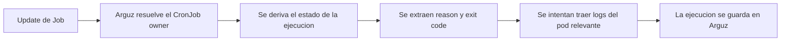

# Workloads, servicios y CronJobs

Esta pagina documenta las vistas runtime que mas se usan despues del onboarding del cluster:

- `https://app.arguz.io/services`
- `https://app.arguz.io/images`
- `https://app.arguz.io/cronjobs`

Complementa la vista orientada a cambios documentada en [Deployments e imagenes](../deployments/index.md).

## Modelo de navegacion de workloads

Arguz expone el mismo estate runtime a traves de lentes operacionales diferentes:

- `Deployments` esta centrado en rollouts y revisiones
- `Services` esta centrado en trafico, logs, dependencias y observabilidad
- `Images` esta centrado en blast radius de imagenes
- `CronJobs` esta centrado en comportamiento de ejecucion programada

## Pagina de services

La pagina `Services` es el punto de entrada para operaciones centradas en el servicio. Agrupa servicios por:

- proyecto
- cluster
- namespace
- nombre de servicio o deployment

El listado sirve para encontrar el workload y luego entrar a una vista de detalle orientada al servicio.

## Vista Service 360

Cuando abres un servicio especifico, Arguz organiza la investigacion en pestanas:

- `Overview`
- `Logs`
- `Patterns`
- `Events`
- `Metrics`
- `Dependencies`
- `Used By`

En terminos operativos, cada pestana responde preguntas distintas:

- `Overview` resume logs recientes, errores, actividad HTTP y recursos salientes
- `Logs` se enfoca en evidencia runtime actual
- `Patterns` ayuda a identificar comportamiento repetido
- `Events` muestra cambios operativos a nivel evento
- `Metrics` muestra el estado de performance del servicio
- `Dependencies` muestra recursos downstream usados por el servicio
- `Used By` muestra dependencias inversas y consumidores

El detalle de service devuelve la investigacion profunda de revisiones y errores a sus vistas especializadas, porque esos flujos tienen mejor contexto de cambio.

## Pagina de imagenes

La pantalla `Images` es compartida con operaciones de deployment, pero muchas veces se usa desde una mirada de servicio o seguridad:

- identificar todos los servicios que usan una imagen
- comparar tags entre namespaces o clusters
- confirmar cuan extendido esta un build riesgoso
- ubicar la revision y el deployment exactos detras de una imagen

## Pagina de CronJobs

Los CronJobs son workloads programados de primera clase en Arguz, no solo un efecto colateral de la captura de eventos generales.

Para cada CronJob, Arguz rastrea:

- expresion cron
- interpretacion humana del horario
- timezone configurada
- estado suspendido
- politica de concurrencia
- ultimo schedule
- ultimo exito
- cantidad de jobs activos
- ultimo estado de ejecucion
- total de ejecuciones
- total de ejecuciones fallidas

## Historial de ejecuciones de CronJob

Cada ejecucion puede incluir:

- nombre del Job y job UID
- pod name cuando existe
- estado de la ejecucion
- timestamps de inicio y termino
- duracion
- exit code
- failure reason
- failure message
- failure logs cuando existen

## Como se capturan las fallas de ejecucion de CronJob

En la practica:

- solo los jobs que realmente pertenecen a un CronJob se tratan como ejecuciones de CronJob
- para ejecuciones fallidas, Arguz intenta ubicar el pod y contenedor mas relevantes
- si hay logs disponibles, se adjuntan para triage rapido dentro de Arguz

## Que cuenta como falla de CronJob

Arguz trata una ejecucion como fallida cuando el estado del job y del contenedor muestra condiciones de error, incluyendo razones comunes como:

- exit code distinto de cero
- `Error`
- `OOMKilled`
- `DeadlineExceeded`

## Como elegir la pagina correcta

Usa `Services` cuando tu pregunta es sobre comportamiento vivo:

- quien depende de este servicio
- que esta logueando
- cuanta actividad tiene ahora

Usa `CronJobs` cuando tu pregunta es sobre automatizacion programada:

- si corrio
- si termino
- que fallo

Usa `Images` cuando tu pregunta es sobre huella de despliegue:

- donde esta corriendo este contenedor
- que workloads siguen usando este tag

Usa `Deployments` o `Releases` cuando tu pregunta es sobre historial de cambios:

- que cambio
- cuando cambio
- que revision introdujo el problema
