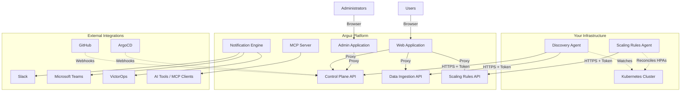
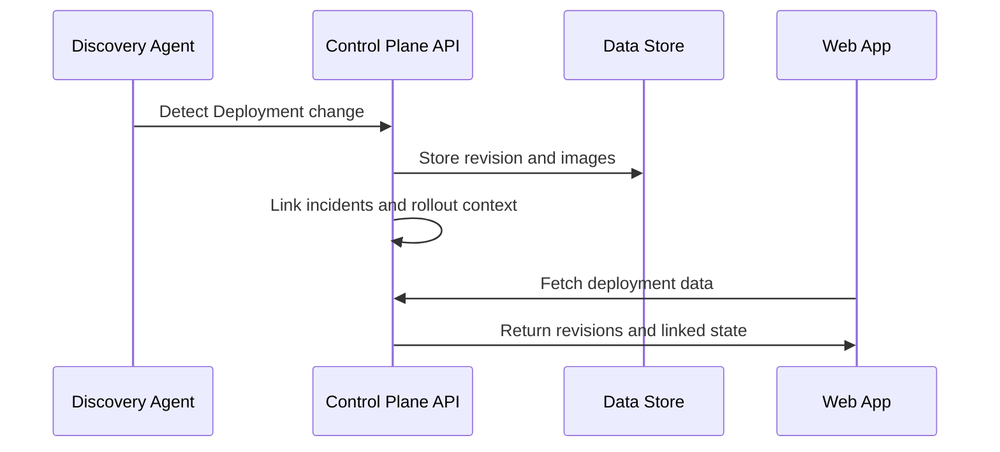
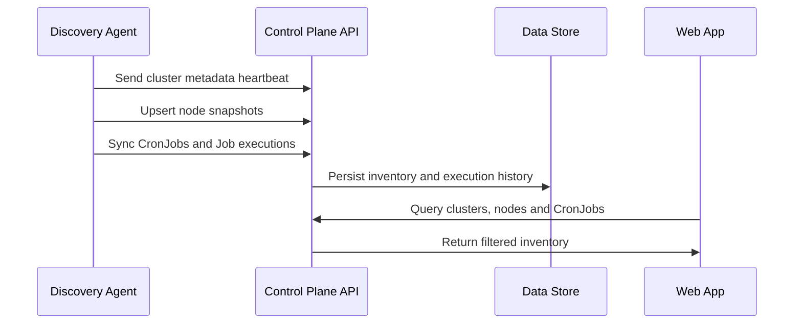
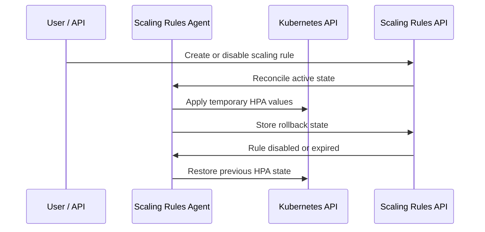

# Architecture

This document describes the high-level architecture of the Arguz platform. It focuses on the components that are currently visible in the product and in the public deployment flow.

## Platform overview

Arguz is built as a multi-tenant SaaS platform deployed on Kubernetes. Customers install the `arguz-agent` chart in their clusters. That chart currently bundles the Discovery Agent and the Scaling Rules Agent, both authenticated with the same cluster credentials secret.

## Key components

### Discovery Agent

- watches Deployments, Jobs, CronJobs, HPAs, Namespaces, Services and related resources
- sends deployment metadata, node snapshots, CronJob inventory and cluster metadata
- uses leader election for high availability
- operates with configurable namespace and resource exclusions

### Scaling Rules Agent

- applies temporary HPA changes from scaling templates
- stores rollback state
- restores previous HPA values when templates expire or are disabled

### Control Plane API

The central API for deployment tracking, cluster management, organization administration, policy management, CronJob inventory and billing.

### Web Application

The main engineering workspace provides:

- overview dashboard
- clusters, nodes and namespace inventory
- deployments, revisions and image tracking
- CronJob schedules and execution history
- errors, notifications and policies

### Admin Application

The Admin Console manages:

- organizations and users
- projects and cluster onboarding
- notification channel creation and maintenance
- billing settings

### Notification Engine

A background worker that evaluates alert policies and event notification policies, then dispatches notifications to configured channels with schedules, throttling and silencing.

## Data flows

### Deployment tracking

### Cluster inventory and CronJob flow

### Scaling execution and rollback

## Authentication model

- users authenticate via Google OAuth or email/password
- agents authenticate with a cluster-specific token
- the web applications proxy backend calls server-side
- the MCP server exposes read-only scoped access tokens

## Storage model

- metadata such as organizations, projects, clusters, revisions, node snapshots and CronJobs is stored in a relational database
- failed CronJob log excerpts are stored with the execution records
- aggregated metrics and summaries are stored for fast dashboard queries

## Security highlights

- all agent communication uses HTTPS
- cluster tokens use constant-time comparison
- browsers never receive internal API tokens
- sanitized manifests preserve resource identities such as Secret names while redacting sensitive values
