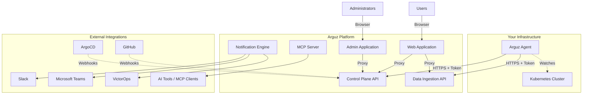
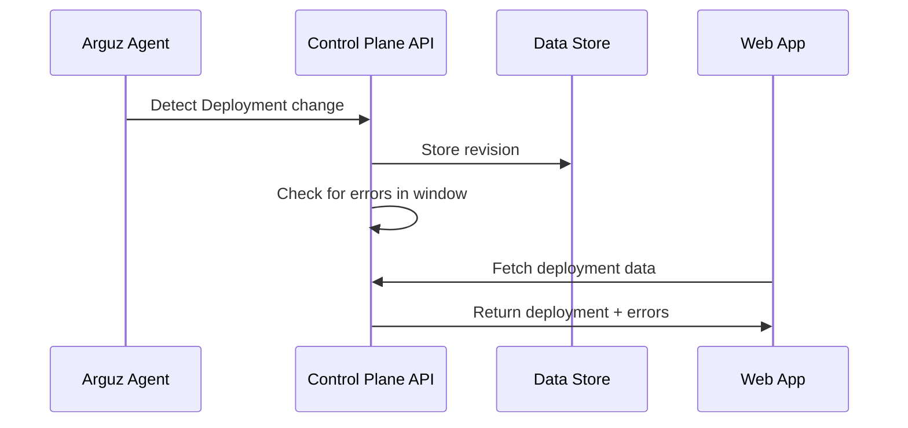
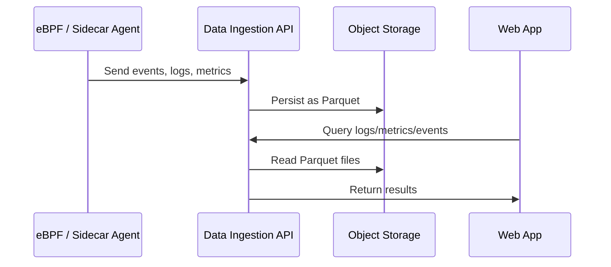
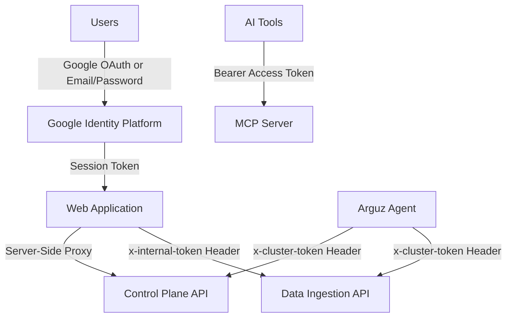

# Architecture

This document describes the high-level architecture of the Arguz platform. It is intended for platform engineers, SRE teams, and operations staff who want to understand how Arguz components interact without revealing proprietary internals.

## Platform Overview

Arguz is built as a multi-tenant SaaS platform deployed on Kubernetes. Customers install a lightweight agent in their clusters, which communicates with the Arguz platform API over HTTPS. All data processing, storage, and analytics happen within the Arguz platform — the agent is strictly a data collector.

## Key Components

### Arguz Agent (Customer Cluster)

A lightweight, read-only component deployed in each registered Kubernetes cluster via Helm. The agent:

- Watches Kubernetes API for changes to Deployments, Pods, HPAs, Namespaces, Services, and related resources
- Sends deployment metadata and cluster state to the Arguz Control Plane API
- Uses leader election for high availability (2 replicas recommended)
- Requires minimal resources (~100m CPU, 128Mi memory per replica)
- Operates with configurable namespace and resource exclusion

The agent does **not** capture application code, modify workloads, execute changes, or alter cluster traffic.

### Control Plane API (`api-discover.arguz.io`)

The central API for deployment tracking, cluster management, organization administration, policy management, and billing. All user-facing operations flow through this API. The web application acts as a proxy, ensuring user sessions and permissions are enforced server-side.

### Data Ingestion API (`di-api.arguz.io`)

A high-throughput API that receives observability telemetry from agents deployed in customer clusters. This includes:

- Application events (HTTP requests, database queries, cloud service calls)
- System errors (OOM kills, HTTP 5xx, TCP resets)
- Application logs (text and structured JSON)
- Kubernetes metrics (pods, nodes, containers, custom)

This API authenticates requests using the same cluster token mechanism as the Control Plane API.

### Web Application (`app.arguz.io`)

The main user-facing dashboard built with Next.js. Provides:

- Deployment and cluster management
- Service 360 observability views (logs, metrics, events, dependencies, patterns)
- Error tracking and root cause analysis
- Alert policy and notification configuration
- Scaling rule management
- User and organization administration

### Admin Application (`app-admin.arguz.io`)

An administrative interface for platform operators and organization administrators:

- Organization management
- Project and cluster administration
- Billing management
- User management

### Notification Engine

A background worker that evaluates alert policies and dispatches notifications to configured channels:

- Slack (Block Kit formatted messages)
- Microsoft Teams
- VictorOps

Supports per-channel active hours/days scheduling and throttling to prevent alert fatigue.

### MCP Server (`mcp.arguz.io`)

A read-only Model Context Protocol (MCP) server that allows AI tools and assistants to query deployment data programmatically. Exposes tools for searching deployments, images, errors, revisions, and cluster metadata. All access is authenticated via bearer tokens and scoped to the user's organization.

## Data Flow

### Deployment Tracking

1. The agent detects a change to a Kubernetes Deployment
2. The agent sends the deployment metadata to the Control Plane API
3. The API stores the revision and associates it with the cluster, namespace, and project
4. The API checks for errors that occurred in a post-deployment window
5. Users view deployment history, revisions, and associated errors in the web application

### Observability Data

1. Observability agents (eBPF or sidecar-based) collect telemetry from workloads
2. Data is sent to the Data Ingestion API in batches
3. The API persists data to object storage in Parquet format
4. Users query logs, metrics, events, and patterns through the web application
5. The web application proxies queries to the Data Ingestion API, which reads from object storage

## Authentication & Authorization

- **Users** authenticate via Google OAuth or email/password (Google Identity Platform)
- **Agents** authenticate with a cluster-specific token (pre-provisioned during cluster registration)
- **Web application** proxies all API calls server-side — browser never sees internal tokens
- **MCP Server** uses bearer access tokens for programmatic read-only access

### Authorization Model

Access is governed by role-based access control (RBAC) within each organization:

| Role | Capabilities |
|---|---|
| Owner | Full access — all view and export capabilities |
| Admin | Full access — all view and export capabilities |
| Editor | Full access — all view and export capabilities |
| Viewer | Read-only access to all observability data |
| Reader | Read-only access to all observability data |

Fine-grained capabilities include:

- `observability.logs.view` / `.export`
- `observability.metrics.view` / `.export`
- `observability.events.view` / `.export`
- `observability.errors.view` / `.export`
- `observability.dependencies.view` / `.export`
- `observability.rca.view` / `.export`
- `observability.patterns.view` / `.export`

## Multi-Tenancy

Organizations are fully isolated:

- All data is scoped to an organization
- The frontend proxy enforces organization membership — cross-organization data access is blocked
- Billing and subscription enforcement is per-organization
- Each organization can have multiple projects, clusters, and users

## Storage

Arguz uses multiple storage backends depending on data type:

- **Metadata** (organizations, projects, clusters, deployments, revisions, users, policies): Stored in a relational database
- **Observability data** (logs, events, metrics, errors): Stored as Parquet files on cloud object storage (GCS, Azure Blob, or S3 depending on organization configuration)
- **Pre-aggregated metrics**: Stored in the relational database for fast dashboard queries

## Security Highlights

- All agent communication is over HTTPS (TLS)
- Cluster tokens use constant-time comparison to prevent timing attacks
- Web application never exposes internal API tokens to browsers
- Server-side authorization checks prevent cross-organization data access (fail-closed)
- Agents run with minimal permissions — read-only access to Kubernetes resources
- Container images run as non-root with read-only filesystems
- Billing enforcement blocks access for organizations with expired subscriptions (402 Payment Required)

## Scalability

The platform is designed for horizontal scaling:

- The Control Plane API scales based on CPU utilization
- The Data Ingestion API uses deterministic routing (jump consistent hash) for efficient distributed processing
- Object storage provides virtually unlimited capacity for observability data
- Each organization can be configured to use its own storage backend for data residency requirements
