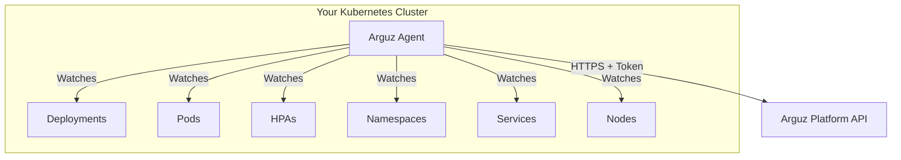

# Installation

This guide covers installing the **Arguz Agent** in your Kubernetes cluster and connecting it to the Arguz platform.

## Architecture

The Arguz Agent is a lightweight, read-only component that runs inside your Kubernetes cluster. It observes cluster state — deployments, pods, HPAs, namespaces, and related resources — and reports changes to the Arguz platform. The agent is deployed via a Helm chart.



## Prerequisites

- Kubernetes cluster v1.24 or later
- Helm 3 installed locally
- `kubectl` configured to access your target cluster
- An Arguz account with:
  - An Organization created
  - A Project created (to associate the cluster with)
  - A Cluster registered in the Arguz web app (this generates your cluster credentials)

## Step 1: Obtain Cluster Credentials

Before installing the agent, register your cluster in the Arguz web application:

1. Log in to [app.arguz.io](https://app.arguz.io)
2. Navigate to **Clusters** and click **Register Cluster**
3. Select your Project
4. Provide a name and description for your cluster
5. Copy the generated credentials: **Project ID**, **Cluster ID**, and **Cluster Token**

!!! warning "Protect Your Token"
    The Cluster Token is a sensitive credential. Treat it like any other Kubernetes secret. It authenticates your agent to the Arguz platform and scopes data to your organization.

## Step 2: Add the Helm Repository

```bash
helm repo add arguz-agent https://Arguz-Labs.github.io/Arguz-Agent-Chart
helm repo update
```

## Step 3: Install the Agent

Install the agent into a dedicated namespace, providing your cluster credentials:

```bash
helm upgrade --install arguz-agent arguz-agent/arguz-agent \
  --version 0.2.0 \
  -n arguz-agent \
  --create-namespace \
  --set-string global.clusterCredentials.projectId=<YOUR_PROJECT_ID> \
  --set-string global.clusterCredentials.clusterId=<YOUR_CLUSTER_ID> \
  --set-string global.clusterCredentials.clusterToken=<YOUR_CLUSTER_TOKEN>
```

The credentials are stored securely in a Kubernetes Secret named `arguz-credentials`.

## Step 4: Verify the Installation

Check that the agent pods are running:

```bash
kubectl get pods -n arguz-agent
```

You should see two replicas of the Discovery Agent running:

```
NAME                              READY   STATUS    RESTARTS   AGE
arguz-agent-discovery-agent-0     1/1     Running   0          30s
arguz-agent-discovery-agent-1     1/1     Running   0          30s
```

Check the logs to confirm the agent has connected:

```bash
kubectl logs -n arguz-agent arguz-agent-discovery-agent-0
```

Within a few minutes, your cluster should appear as connected in the Arguz web application, and deployments will begin appearing.

## Configuration Options

The agent supports configuration via a YAML config file or Helm values:

### Agent Config (`config.yaml`)

| Option | Description | Default |
|---|---|---|
| `log_level` | Agent log verbosity (`info`, `debug`, `warn`) | `info` |
| `ignore_namespaces` | List of namespaces to exclude from monitoring | `[kube-system]` |
| `ignore_resources` | Resource globs to ignore (e.g., `job/*`) | `[job/*]` |
| `ignore_node_labels` | Node labels to exclude from snapshots | `[]` |

### Helm Values

| Value | Description | Default |
|---|---|---|
| `Discovery-Agent.replicaCount` | Number of agent replicas (uses leader election) | `2` |
| `Discovery-Agent.resources.limits.cpu` | CPU limit per agent pod | `100m` |
| `Discovery-Agent.resources.limits.memory` | Memory limit per agent pod | `128Mi` |
| `Discovery-Agent.env.API_URL` | Arguz API endpoint | `https://api-discover.arguz.io` |
| `Discovery-Agent.image.repository` | Agent container image | `ghcr.io/arguz-labs/arguz-discovery-agent` |

### Example: Custom Configuration

Create a custom values file:

```yaml
# my-values.yaml
global:
  clusterCredentials:
    projectId: "<PROJECT_ID>"
    clusterId: "<CLUSTER_ID>"
    clusterToken: "<CLUSTER_TOKEN>"

Discovery-Agent:
  replicaCount: 2
  config:
    content: |
      log_level: info
      ignore_namespaces:
        - kube-system
        - cert-manager
        - monitoring
      ignore_resources:
        - job/*
        - CronJob/*
```

Install with:

```bash
helm upgrade --install arguz-agent arguz-agent/arguz-agent \
  --version 0.2.0 \
  -n arguz-agent \
  --create-namespace \
  -f my-values.yaml
```

## Upgrading

To upgrade the agent to a new version:

```bash
helm repo update
helm upgrade arguz-agent arguz-agent/arguz-agent \
  -n arguz-agent
```

## Uninstalling

To remove the agent from your cluster:

```bash
helm uninstall arguz-agent -n arguz-agent
kubectl delete namespace arguz-agent
```

!!! note
    Uninstalling the agent stops data collection. Historical data already ingested into the Arguz platform is preserved.

## High Availability

The Arguz Agent uses Kubernetes **Leader Election** via Leases to ensure only one replica actively watches cluster resources at a time. This prevents duplicate data while providing failover:

- If the leader pod becomes unhealthy, another replica takes over within ~10 seconds
- Recommended configuration: 2 replicas

## Next Steps

- [Quickstart Guide](quickstart.md) — Start exploring your deployment data
- [Agent Overview](../agent/overview.md) — Understand what the agent does
- [Agent Required Permissions](../agent/permissions.md) — RBAC configuration
