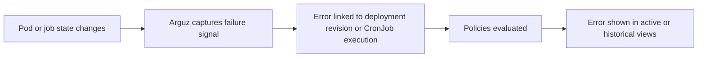
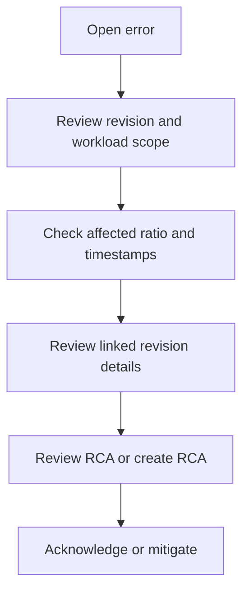

# Incidents & Errors

Arguz records runtime failures with workload and rollout context so incident review starts from a revision-aware model rather than an isolated log snippet.

This page documents the behavior behind:

- `https://app.arguz.io/errors`
- `https://app.arguz.io/errors/history`

## Active versus historical views

- `Errors` is the operational queue for current or recent issues that still require review.
- `Errors History` adds a wider date range and is used for post-incident review, trend analysis and audit.

Both pages use the same hierarchy filters:

- project
- cluster
- namespace
- deployment

## How an error becomes visible

## Error families currently captured

Arguz captures multiple workload failure conditions for deployment revisions, including:

- `CrashLoopBackOff`
- `ImagePullBackOff`
- `ErrImagePull`
- `ErrImageNeverPull`
- `CreateContainerConfigError`
- `CreateContainerError`
- `RunContainerError`
- `ContainerCannotRun`
- `InvalidImageName`
- `CreatePodSandboxError`
- `CreateContainerSandboxError`
- `NetworkPluginNotReady`
- `PodFailed`
- `OOMKilled`
- `Error`
- `DeadlineExceeded`
- `Failed`
- `Unknown`
- `Pending`
- `Evicted`
- `Unschedulable`
- `ContainersNotReady`
- `NotReady`
- `NotInitialized`
- `Restarts`
- equivalent init-container variants such as `Init:CrashLoopBackOff` and `Init:OOMKilled`

CronJob failures are tracked separately through execution history and can include:

- job status
- exit code
- failure reason
- failure message
- log excerpts when available

## What an error record contains

A deployment revision error can include:

- error type
- human-readable message
- structured details
- severity
- affected pods
- total pods
- affected ratio
- occurrence time
- mitigated state
- mitigation timestamp
- related revision and workload scope

This is why Arguz can evaluate threshold-based alert policies instead of sending every failure as an identical notification.

## Investigation flow

## Acknowledge versus mitigate

These actions are intentionally different:

- `Acknowledge` is used when an alert already fired and an operator is taking ownership of the issue
- `Mitigate` is used when the team considers the error operationally handled for Arguz tracking purposes

In practice:

- acknowledgement is tied to alert-aware workflows
- mitigation affects how the issue is treated in operational review and policy follow-up

## RCA workflow

Error review in Arguz is revision-aware:

- the error detail can load the related revision
- the revision supplies rollout, image, service and provider context
- RCA notes and assistant-driven summaries can be attached where permissions allow it

The important user-facing point is that RCA starts from captured runtime facts, not from a blank text area.

## How policies use captured errors

Alert policies evaluate runtime errors using:

- organization
- path and scope
- error type
- affected ratio
- delay window
- silence state
- enabled state
- active notification channel windows

See [Policies & Governance](../policies/index.md) and [Notifications](../notifications/index.md) for the exact notification behavior.

## Recommended incident workflow

1. Start on `Errors` for active operational response.
2. Open the related revision before assuming the root cause.
3. Use the affected ratio to separate localized from broad failures.
4. Check whether a policy should have notified the right team.
5. Use `Errors History` for retrospectives and recurring pattern review.
