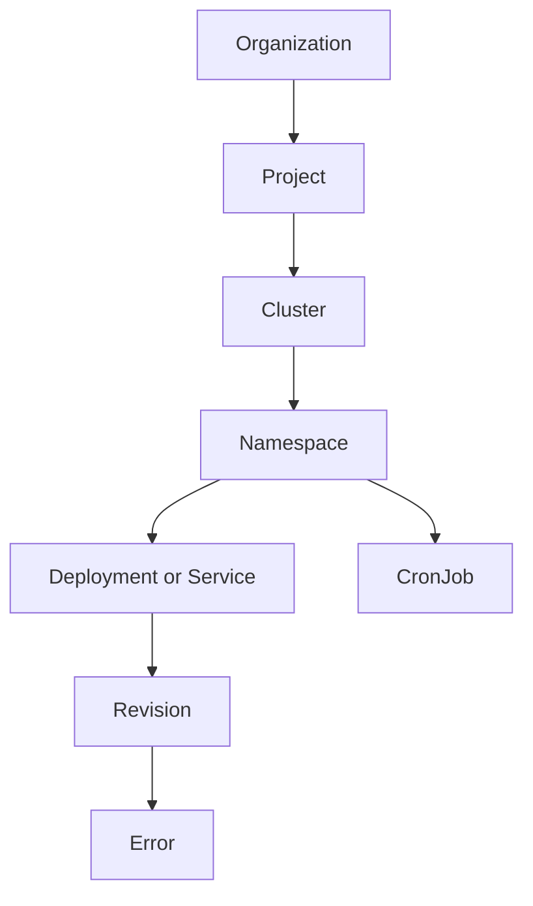
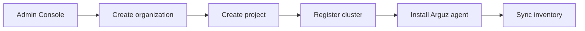
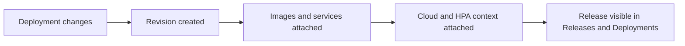
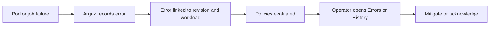
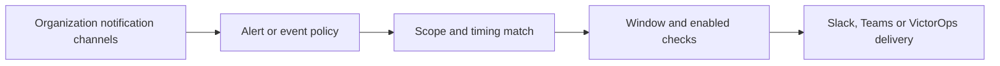

# Arguz Documentation

Arguz is a Kubernetes operations platform centered on five connected jobs:

- model the runtime hierarchy of your estate
- track every rollout as a revision
- capture runtime failures with rollout context
- route notifications through reusable policies
- keep organizational access, clusters and channels governed from one place

This documentation is written so an operator can move from onboarding to day-2 operations without depending on hidden product knowledge.

## Language entry points

| Language | Start here |
|---|---|
| English | [Getting Started](getting-started/) |
| Español | [Documentacion en espanol](es/) |

## Resource hierarchy

The main mental model in Arguz is hierarchical. Most screens, filters and permissions follow this chain:

## What each level means

- `Organization` is the tenant boundary for users, groups, billing, notification channels, policies and SSO settings.
- `Project` groups clusters that belong to the same business domain, team or environment.
- `Cluster` is the registered Kubernetes target connected through the Arguz agent.
- `Namespace` scopes workloads inside a cluster.
- `Deployment` is the rollout unit tracked by Arguz for revision and incident correlation.
- `Service` is the traffic-facing view of a workload and is used to explore logs, events, metrics and dependencies.
- `Revision` is the immutable snapshot created for a rollout.
- `CronJob` is the scheduled execution unit tracked separately from deployment revisions.

## Core product flows

### 1. Onboard and discover

### 2. Follow a rollout

### 3. Investigate an incident

### 4. Notify the right channel

## Access model at a glance

Arguz combines baseline membership with fine-grained roles:

- `organization.owner` has full control of the organization.
- Membership roles are `viewer`, `editor` and `admin`.
- `viewer` is the minimum role and follows least-privilege by default.
- By default, `viewer` can list organizations and depends on administrator-granted permissions for additional access.
- Direct user roles can grant feature-specific permissions.
- Group roles let teams inherit the same permissions without editing users one by one.
- Some screens also enforce feature permissions such as revision viewing, error RCA, policy editing or cluster administration.

The full operating model is described in [Administration](administration/index.md) and [Azure AD](integrations/azure-ad.md).

## Documentation map

| Need | Page |
|---|---|
| Understand releases, revisions and rollout context | [Revision History](revisions/index.md) |
| Work with deployments and image inventory | [Deployments & Images](deployments/index.md) |
| Operate clusters and inspect node inventory | [Clusters & Nodes](clusters/index.md) |
| Understand services, CronJobs and execution history | [Workloads, Services & CronJobs](workloads/index.md) |
| Investigate active and historical failures | [Incidents & Errors](incidents/index.md) |
| Configure channels and understand delivery logic | [Notifications](notifications/index.md) |
| Configure alerting, event routing and scaling automation | [Policies & Governance](policies/index.md) |
| Manage organizations, projects, users, groups and clusters | [Administration](administration/index.md) |
| Set up Microsoft Entra ID per organization | [Azure AD](integrations/azure-ad.md) |
