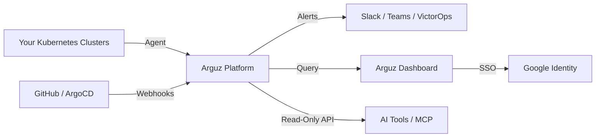

# Arguz Documentation

Welcome to the official Arguz documentation. Arguz is a **Kubernetes Deployment Governance and Observability Platform** that provides real-time visibility into your production deployments, helps you understand the impact of every change, and accelerates incident resolution with AI-powered root cause analysis.

## What Arguz Does

Arguz connects your Kubernetes clusters, Git repositories, and CI/CD pipelines into a unified observability and governance layer. It gives platform engineers, SRE teams, and developers a shared source of truth for:

- **Deployment Tracking** — Know exactly what was deployed, when, and by whom across all your clusters.
- **Change Impact Analysis** — Understand how every deployment affects service health, error rates, and latency.
- **Service 360 Observability** — Get a complete picture of each service: logs, metrics, events, dependencies, and error patterns.
- **Incident Response** — Detect errors, trace them to specific deployments, and get AI-powered root cause analysis.
- **Governance & Policies** — Enforce change freezes, alert policies, and scaling rules across your organization.
- **Multi-Cluster Visibility** — Manage multiple Kubernetes clusters from a single pane of glass.

## Who Is This For?

- **Platform Engineers** — Govern deployments across your organization's Kubernetes footprint.
- **SRE Teams** — Reduce MTTR with deployment-aware observability and automated RCA.
- **DevOps Engineers** — Integrate deployment tracking into existing CI/CD workflows.
- **Development Teams** — Self-service visibility into how your changes behave in production.
- **Operations Teams** — Alert on deployment anomalies and service degradation.

## Key Concepts

| Concept | Description |
|---|---|
| **Organization** | Your company or team account in Arguz. Contains projects, clusters, and users. |
| **Project** | A logical grouping of clusters and namespaces (e.g., "payments", "frontend"). |
| **Cluster** | A Kubernetes cluster registered with Arguz. Runs the Arguz Agent. |
| **Deployment** | A Kubernetes Deployment tracked by Arguz across revisions. |
| **Revision** | A specific version of a deployment — captured when a change is detected. |
| **Agent** | A lightweight component installed in your Kubernetes cluster that collects metadata and observability data. |

## Quick Navigation

| Section | For |
|---|---|
| [Getting Started](getting-started/index.md) | New users — install, configure, and explore |
| [Arguz Agent](agent/index.md) | Understanding the agent: data, security, and limitations |
| [Deployments](deployments/index.md) | Tracking and managing deployments |
| [Clusters](clusters/index.md) | Managing Kubernetes clusters |
| [Workloads & Services](workloads/index.md) | Service observability and dependency mapping |
| [Revisions](revisions/index.md) | Deployment revision history |
| [Incidents & Errors](incidents/index.md) | Error detection and incident management |
| [Root Cause Analysis](rca/index.md) | AI-powered RCA |
| [Notifications](notifications/index.md) | Slack, Teams, VictorOps alerts |
| [Policies](policies/index.md) | Alert policies, scaling rules, freeze windows |
| [Integrations](integrations/index.md) | GitHub, ArgoCD, authentication |
| [FAQ](faq/index.md) | Frequently asked questions |
| [Glossary](glossary.md) | Terminology reference |

## Platform at a Glance

Arguz is delivered as a SaaS platform. You install the **Arguz Agent** in your Kubernetes clusters, and all observability data, deployment tracking, and governance features are available through the Arguz web application at [app.arguz.io](https://app.arguz.io).
