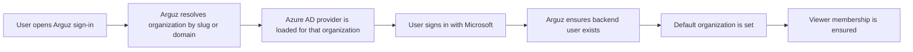

# Azure AD

Arguz supports Microsoft Entra ID at the organization level. The integration is configured in the Admin Console and then used by both the main app and the admin app sign-in flows.

## What this integration is for

Use Azure AD when you want:

- organization-specific Microsoft sign-in
- domain-aware enterprise access
- a shareable slug-based SSO entry point
- automatic baseline membership for users signing in through the configured organization

## Where it is configured

Azure AD is configured on the organization record in the Admin Console.

Required fields:

- organization slug
- Azure AD enabled
- tenant ID
- client ID
- client secret

Optional but important fields:

- primary domain
- additional domains
- authority host

## Sign-in resolution model

Arguz first needs to determine which organization the user is trying to access.

It can do that from:

- the organization slug
- the primary domain
- any additional configured domain
- the email domain used as a hint during sign-in

## Azure AD sign-in flow

## What happens after a successful Microsoft sign-in

When the sign-in belongs to a valid Azure-enabled organization, Arguz:

- creates or reuses the backend user record
- sets the default organization for that user when needed
- ensures the user has at least `viewer` membership in the organization

 This is an important operating rule:

- Azure AD sign-in gives the user a baseline organization membership
- that baseline is `viewer`, which follows least-privilege by default
- by default that means the user can list organizations and only expands from admin-granted permissions
- it does not automatically make the user an admin, editor or owner
- higher privileges still need to be granted through organization membership changes, direct roles or groups

## Slug-based access link

Arguz can generate a shareable organization-specific sign-in link based on the organization slug. This is the preferred end-user entry point for Microsoft SSO because it removes ambiguity about which organization configuration should be used.

Use the slug link when:

- the same company operates more than one Arguz organization
- users should land directly on the right tenant
- you want to avoid depending on email-domain discovery alone

## Domain fields and why they matter

- `primary_domain` identifies the main business domain of the organization
- `domains` lets you add alternative domains
- these values help Arguz resolve the organization from sign-in hints

This is especially useful when users do not start from the shared slug link.

## Operational guidance

1. Define the organization slug first.
2. Add the primary domain and any secondary domains.
3. Enable Azure AD and complete tenant, client and secret fields.
4. Test the slug-based login URL.
5. Share that URL with end users.
6. After first sign-in, review whether the user needs only `viewer` access or additional roles.

## Common expectations

- one Azure-enabled organization is enough to enable Microsoft sign-in for that organization flow
- organization-specific configuration is what controls the Azure provider used at sign-in time
- sign-in success and authorization level are separate concerns

If Microsoft sign-in works but the user cannot manage resources, the issue is usually missing Arguz roles, not Azure AD itself.
