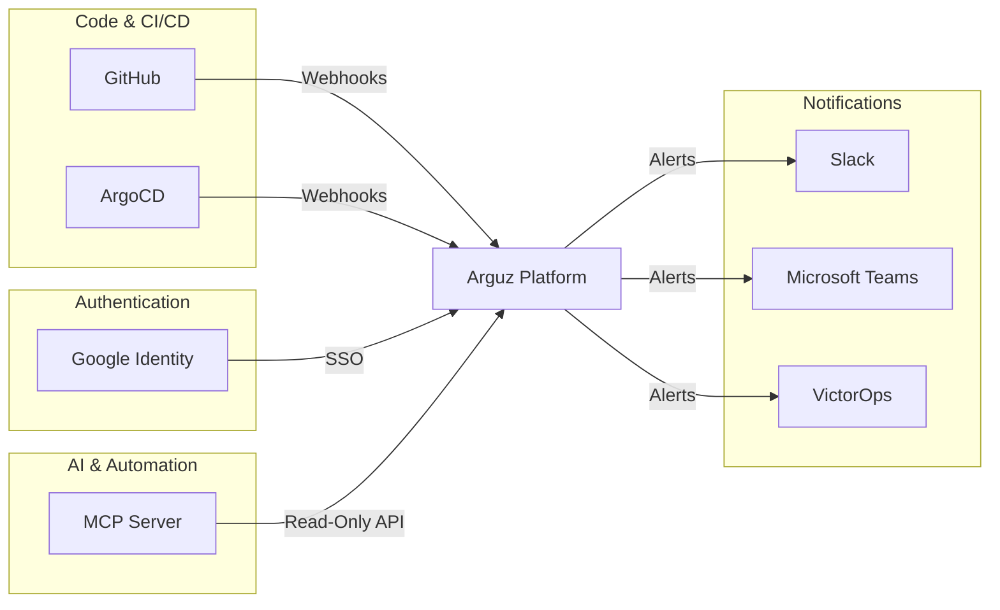

# Integrations

Arguz integrates with your existing toolchain to provide deployment context, authentication, and notification delivery. This section covers the available integrations.

## Integration Overview



| Integration | Type | Purpose |
|---|---|---|
| [GitHub](github.md) | CI/CD | Correlate deployments with Git commits and pull requests |
| [ArgoCD](argocd.md) | GitOps | Track deployments managed by ArgoCD |
| [Google Authentication](google-auth.md) | Auth | User authentication via Google OAuth or email/password |
| Slack | Notification | Alert delivery to Slack channels |
| Microsoft Teams | Notification | Alert delivery to Teams channels |
| VictorOps | Notification | Incident alerting via VictorOps/Splunk On-Call |
| MCP Server | AI/Automation | Read-only API for AI tools and automation |

## MCP Server (Model Context Protocol) {#mcp-server}

The Arguz MCP Server provides a **read-only** API endpoint that enables AI tools and automation to query your deployment data programmatically.

### What You Can Do

The MCP Server exposes tools for:

- Listing and searching organizations, projects, clusters, and namespaces
- Searching deployments by name, image, namespace, status, or HPA presence
- Listing and searching revisions and their errors
- Searching container images across all deployments
- Retrieving HPA configurations for deployments
- Getting authenticated user information

### Authentication

Access the MCP Server with a bearer token:

```json
{
  "mcpServers": {
    "arguz-mcp-server": {
      "url": "https://mcp.arguz.io/mcp",
      "headers": {
        "Authorization": "Bearer YOUR_ACCESS_TOKEN"
      }
    }
  }
}
```

Access tokens are generated from the Arguz web application under user settings.

### Data Access

The MCP Server is **read-only**:

- No write, update, or delete operations
- All queries are parameterized to prevent SQL injection
- Results are scoped to the authenticated user's organization memberships
- The server operates in read-only database sessions
- Query timeouts prevent resource exhaustion

### Available Tools

| Tool | Description |
|---|---|
| `organizations_list` | List accessible organizations |
| `projects_list` | List projects |
| `clusters_list` | List clusters with metadata |
| `namespaces_list` / `namespaces_search` | List or search namespaces |
| `deployments_list` / `deployments_search` | List or search deployments |
| `revisions_list` / `revisions_search` | List or search revisions |
| `revision_errors_list` / `revision_errors_active` | Get errors for a revision |
| `errors_search` | Search errors across the platform |
| `revisions_with_errors_list` | Find revisions with active errors |
| `images_search` | Search container images across deployments |
| `deployment_hpa` | Get HPA configuration for a deployment |
| `auth_whoami` | Get authenticated user information |

### Example Use Cases

- **AI-Assisted Troubleshooting**: Feed deployment and error data to an AI assistant for faster diagnosis
- **Automated Reporting**: Build scripts that query deployment status for daily reports
- **Inventory Management**: Programmatically audit which images are running across your fleet
- **Custom Dashboards**: Integrate Arguz data into your internal tools
