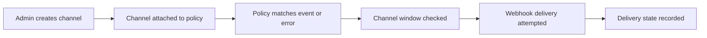

# Notifications

Arguz separates notification delivery into two layers:

- organization-owned notification channels
- policy-owned rules that decide when those channels are used

This page documents the behavior behind:

- `https://app.arguz.io/event-notification-policies`
- channel management in `https://app-admin.arguz.io/admin/organizations/<organization-id>/notification-channels`

Alert-specific matching is described in [Policies & Governance](../policies/index.md).

## Supported channel types

Arguz currently supports:

- Slack
- Microsoft Teams
- VictorOps

## Where channels are created

Channels are created in the Admin Console at the organization level. A channel belongs to one organization and can then be attached to policies in the main app.

Typical channel settings are:

- `Slack`: incoming webhook URL and optional default channel label
- `Microsoft Teams`: incoming webhook URL
- `VictorOps`: webhook URL

Each channel can also be globally enabled or disabled.

## Delivery model

## Channel windows and schedules

Policies can define channel-specific active windows using:

- active days
- active start time in UTC
- active end time in UTC

This means:

- the same channel can be active for one policy and inactive for another
- delivery is evaluated against UTC windows, not local browser time
- leaving the schedule empty means the channel is always eligible for that policy

## Enabled state and retries

Arguz checks several conditions before final delivery:

- the policy must be enabled
- the channel must be enabled
- the policy must not be silenced for the current evaluation time
- the channel must be inside its configured active window

Operationally:

- when a channel is not eligible at the current time, Arguz avoids treating it as a successful send
- event notification sends keep a delivery state so they can be retried when applicable
- alert notification sends also track their processing state to avoid blind duplicate behavior

## Delivery states you should understand

Arguz internally records delivery progress so operators can reason about what happened:

- `processing` means the send is queued or in progress
- `alerted` means the send was delivered
- alert-related workflows can also move through states such as `resolved` or `acknowledged`

The exact UI for these states may differ by screen, but the operational meaning remains the same.

## What gets delivered

There are two distinct notification families:

- `Alert notifications` are driven by captured runtime errors and alert policy evaluation
- `Event notifications` are driven by lifecycle events

The event family currently includes at least:

- `deployment.revision.created`

That means Arguz can notify teams when a new revision is created even if no failure has occurred yet.

## What a notification contains

Depending on the channel type and policy family, the delivery payload can include:

- project, cluster, namespace and service context
- revision number
- matched policy name
- affected ratio for alerts
- event path for revision-created notifications
- links back into Arguz for RCA or review

## Practical operating pattern

1. Create channels once in Admin.
2. Keep channels named by team or escalation purpose.
3. Use policy schedules instead of duplicating channels for day and night shifts.
4. Keep channels disabled rather than deleted when you need temporary freeze control.
5. Validate notifications together with scope design, not as a standalone setup.
