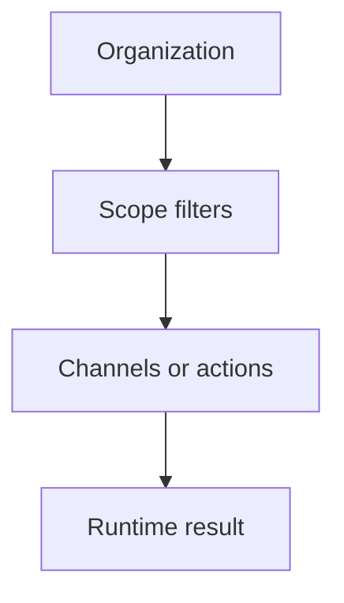
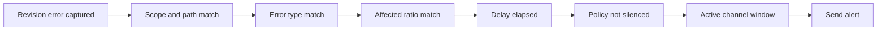
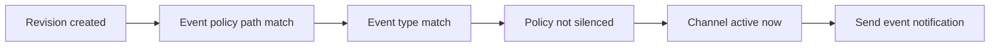
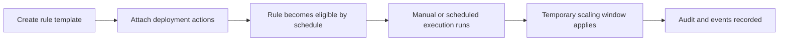

# Policies & Governance

Arguz governance is built around three operational policy families:

- alert policies
- event notification policies
- scaling rules

This page documents the behavior behind:

- `https://app.arguz.io/alert-policies`
- `https://app.arguz.io/event-notification-policies`
- `https://app.arguz.io/scaling-rules`

## Policy hierarchy

All three policy families inherit the organization boundary and then narrow the target scope through workload path information.

## Alert policies

Alert policies are error-driven. They evaluate captured deployment revision errors and decide whether a notification should be sent.

### Alert policy inputs

An alert policy can combine:

- name and description
- enabled state
- one or more error types
- minimum affected ratio
- path matching
- project, cluster, namespace and deployment scope
- silence window
- delay in seconds
- one or more notification channels
- active UTC windows per channel

### How alert matching works

### What the delay means

The delay prevents immediate alerting on very fresh failures. Arguz waits until the configured number of seconds has elapsed since the error occurrence before sending.

Use delay when:

- the error is often transient during startup
- you want to reduce noise from short-lived rollout turbulence

### What the affected ratio means

The affected ratio reflects how much of the workload is impacted. This lets teams distinguish:

- one unhealthy pod in a larger rollout
- a broad service failure affecting most or all pods

## Event notification policies

Event notification policies are not failure-driven. They route lifecycle events to the right channels.

### Event policy inputs

An event notification policy can combine:

- name and description
- enabled state
- event types
- path matching
- silence window
- one or more channels
- active UTC windows per channel

### Current event model

The current documented event flow includes:

- `deployment.revision.created`

This means event policies are useful when teams want deployment awareness even before incidents exist.

### Event evaluation flow

## Scaling rules

Scaling rules are scheduled or manual runtime actions designed to temporarily override service scaling behavior in a controlled and auditable way.

### What a scaling rule contains

- name
- description
- cron expression
- timezone
- optional duration in minutes
- optional expiration date
- enabled state
- creator information
- one or more scaling actions attached to deployments

### What a scaling action contains

For each selected deployment, Arguz can store:

- project
- cluster
- namespace
- deployment
- minimum replicas
- maximum replicas
- default replicas
- HPA context when present

### Scaling rule flow

### Duration and expiration behavior

- `duration_minutes` controls how long a rule execution should remain active
- `valid_until` defines the last date at which the rule is considered valid
- a rule can be scheduled or run manually
- manual execution can be created and cancelled independently of the template definition

### What operators typically do with scaling rules

- prepare for traffic peaks
- reduce capacity after a known busy window
- coordinate temporary scaling during maintenance or releases
- document which deployments are being intentionally scaled and by how much

### Auditability

Scaling rules include supporting views for:

- action review
- event history
- audit history
- manual execution state

Treat these screens as the operational source of truth for planned temporary scaling.

## Choosing the right policy family

Use `Alert Policies` when the trigger is a failure.

Use `Event Notification Policies` when the trigger is an operational event, such as a new revision.

Use `Scaling Rules` when the desired outcome is a temporary runtime scaling change rather than a notification.
