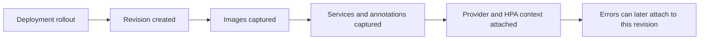
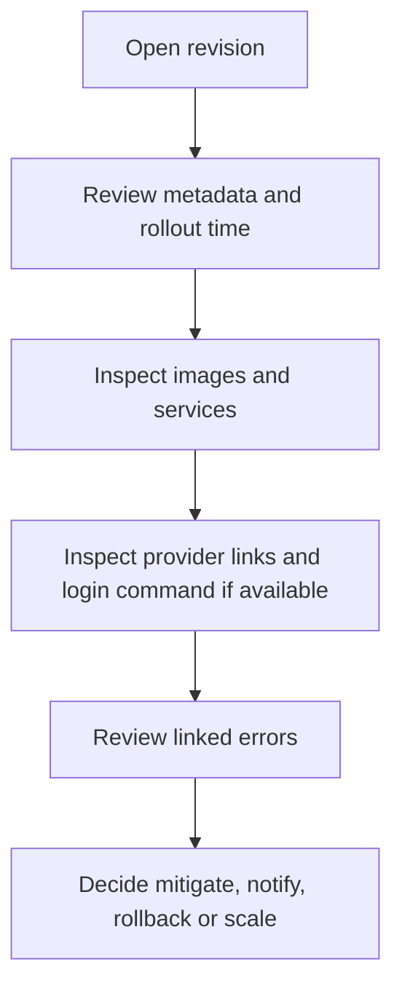

# Revision History

The `Releases` experience in Arguz is built on revisions. A revision is the immutable operational checkpoint created for a deployment rollout.

This page documents the behavior behind:

- `https://app.arguz.io/releases`

## Why revisions exist

Revisions let operators answer the hardest day-2 question quickly:

> Did this problem begin because the workload changed, or did it begin while the workload stayed the same?

Arguz solves that by attaching failures, images, cloud context and HPA state to a concrete rollout record.

## Revision lifecycle

## What a revision contains

A revision can include:

- revision identifier and revision number
- deployment identifier and service name
- namespace, cluster and project context
- creation and update timestamps
- status
- reviewer or actor information when available
- rollout notes when available
- deployment annotations and pod annotations
- images used by the revision
- service references detected for the revision
- HPA snapshot when available
- cloud provider metadata and cloud console links when available
- linked runtime errors

## What the `Releases` page is for

The releases page is the filtered list of revision history across the selected organization scope. It helps teams:

- review recent rollouts
- narrow the blast radius of a risky change
- compare one deployment against other recent changes
- move from a revision into image, service, cluster or error detail

## Revision detail flow

When an operator opens a revision, the goal is to move from a generic rollout to an actionable diagnosis:

## Provider context in revision detail

If cloud metadata is available for the cluster, revision detail may expose:

- provider badge
- cluster and namespace links
- workload links
- YAML or detail links when the provider context supports them
- a login command that helps the operator reach the target cluster

These are operator conveniences. The revision remains valid even if cloud links are missing.

## Image and service context inside a revision

Revision detail is where change context becomes explicit:

- the current image set shows what actually rolled out
- previous image sets can be compared to identify the changed container
- detected services show which traffic-facing objects are tied to the revision

This is why revisions are the best bridge between `Deployments`, `Images`, `Services` and `Errors`.

## Errors attached to a revision

Errors are not stored in isolation. When a runtime issue is captured for a deployment, Arguz ties it back to the corresponding revision so operators can answer:

- which rollout introduced the failure window
- what image set was active
- what fraction of pods were affected
- whether a policy should have notified the team

See [Incidents & Errors](../incidents/index.md) for the detailed failure model.

## Common operator workflows

### Validate the latest release

1. Open `Releases`.
2. Filter by project, cluster, namespace or deployment.
3. Open the latest revision.
4. Confirm rollout time, images and status.

### Correlate a failure with a change

1. Open a revision from `Releases` or from an error detail.
2. Review rollout time and image changes.
3. Open linked errors.
4. Compare the new revision with the previous known healthy state.

### Prepare a rollback or scaling response

1. Open the affected revision.
2. Confirm the exact workload scope.
3. Review the HPA context and image set.
4. Continue into scaling rules, error mitigation or external deployment tooling.

## Access expectations

Revision access can be broader or narrower depending on organization roles and feature permissions. In practice, teams commonly separate:

- revision visibility
- manifest visibility
- error visibility
- RCA creation and review

If a user can open releases but cannot see sensitive revision details, the missing permission is usually deliberate rather than a data issue.
