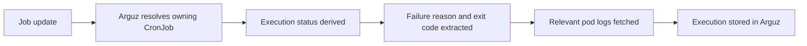

# Workloads, Services & CronJobs

This page documents the runtime-centric views that operators use after cluster onboarding:

- `https://app.arguz.io/services`
- `https://app.arguz.io/images`
- `https://app.arguz.io/cronjobs`

It complements the rollout-centric view documented in [Deployments & Images](../deployments/index.md).

## Workload navigation model

Arguz exposes the same runtime estate through different operational lenses:

- `Deployments` focuses on rollout and revision history
- `Services` focuses on traffic, logs, dependencies and observability
- `Images` focuses on image blast radius
- `CronJobs` focuses on scheduled execution behavior

## Services page

The `Services` page is the entry point for service-centric operations. It groups services by:

- project
- cluster
- namespace
- service or deployment name

The list lets operators find a workload first, then pivot into a service-focused detail view.

## Service 360 view

When you open a specific service, Arguz organizes the investigation into tabs:

- `Overview`
- `Logs`
- `Patterns`
- `Events`
- `Metrics`
- `Dependencies`
- `Used By`

Operationally, those tabs answer different questions:

- `Overview` summarizes recent logs, errors, HTTP activity and outbound resources
- `Logs` focuses on current runtime evidence
- `Patterns` helps identify recurring behavior
- `Events` shows event-level operational changes
- `Metrics` shows the current service performance picture
- `Dependencies` shows downstream resources used by the service
- `Used By` shows reverse dependencies and consumers

The service detail intentionally sends revision and error deep investigation back to the dedicated revision and errors views, because those workflows carry more change context.

## Images page

The `Images` page is shared with deployment operations but it is often used from a service or security perspective:

- identify every service using a given image
- compare tags across namespaces or clusters
- confirm how widely a risky build is deployed
- locate the exact revision and deployment behind a container image

## CronJobs page

CronJobs are first-class scheduled workloads in Arguz, not just a by-product of general event collection.

For each CronJob, Arguz tracks:

- cron expression
- human schedule interpretation
- configured timezone
- suspend state
- concurrency policy
- last scheduled time
- last successful time
- active job count
- latest execution status
- total executions
- failed executions

## CronJob execution history

Each execution record can include:

- job name and job UID
- pod name when available
- execution status
- start and completion timestamps
- duration
- exit code
- failure reason
- failure message
- failure logs when available

## How CronJob execution failures are captured

In practical terms:

- only jobs owned by a CronJob are treated as CronJob executions
- failed executions attempt to capture the most relevant pod and failing container
- failure logs are attached when available so operators can triage without leaving Arguz

## What counts as a failed CronJob execution

Arguz treats a CronJob execution as failed when the underlying job and container state indicate failure, including common termination reasons such as:

- non-zero exit code
- generic `Error`
- `OOMKilled`
- `DeadlineExceeded`

## Choosing the right page

Use `Services` when your question is about live behavior:

- who depends on this service
- what does it log
- how active is it right now

Use `CronJobs` when your question is about scheduled automation:

- did the job run
- did it finish
- what failed

Use `Images` when your question is about deployment footprint:

- where is this container running
- which workloads still use this tag

Use `Deployments` or `Releases` when your question is about change history:

- what changed
- when it changed
- which revision introduced the issue
