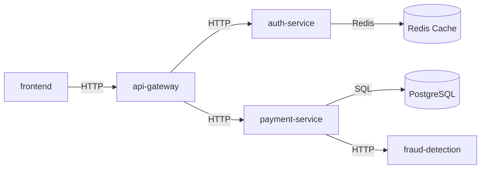

# Workloads & Services

Arguz provides comprehensive visibility into your workloads — services, their dependencies, the container images they run, and the patterns of behavior they exhibit.

## Service 360 View

The Service 360 view is the central interface for understanding a single service. It is accessible by clicking any deployment from the Deployments list.

### Overview

The Overview tab provides an at-a-glance health assessment:

- Current deployment status and replica availability
- Recent revision history (timeline of deployments)
- Active and recent errors
- HPA configuration summary (if autoscaling is configured)
- Key metrics at a glance (error rate, latency P95, request rate)

### Logs

Arguz ingests and indexes application logs, making them searchable and analyzable:

**Searching Logs**:

- Free-text search across log messages
- Filter by severity level (ERROR, WARN, INFO, DEBUG)
- Filter by time range (absolute or relative)
- Filter by structured JSON fields (if your logs are in JSON format)

**Pattern Discovery**:

Arguz automatically extracts log **patterns** — the structural template of log messages with variable parts replaced. For example:

```
Log: "User alice@example.com logged in from 192.168.1.1"
Pattern: "User <*> logged in from <*>"
```

This groups related log messages together, making it easy to:

- Identify the most frequent log messages
- Spot new or unusual log patterns after a deployment
- Reduce noise by focusing on patterns rather than individual lines

**Log Metrics**:

You can derive metrics from log data:
- Rate of log messages matching a pattern
- Sum of numeric values extracted from logs
- Quantile analysis of log-derived values

**Facets**:

Facets provide distribution analysis — e.g., "show me the distribution of HTTP status codes in logs over the last hour."

**Anomalies**:

Arguz can detect anomalous log patterns — patterns that appear or spike suddenly, which may indicate a problem.

### Events

Events represent structured application telemetry:

**HTTP Events**:
- Method (GET, POST, PUT, DELETE, etc.)
- Path
- Status code
- Latency (response time)
- Source and destination services

**Database Events**:
- Database type (PostgreSQL, MySQL, MongoDB, Redis)
- Operation (SELECT, INSERT, UPDATE, DELETE, CONNECT)
- Query latency
- Error information if the query failed

**Cloud Service Events**:
- Google Cloud Pub/Sub (publish and receive events)
- Google Cloud Firestore operations
- Google Cloud BigQuery queries
- Google Cloud Storage operations
- Google Cloud Secret Manager access
- Google Cloud Tasks execution
- Google Cloud Vertex AI calls

You can filter events by type, status code, path, method, and time range.

### Metrics

Time-series metrics for your service:

- **Kubernetes Pod Metrics**: CPU usage, memory usage, network bytes, storage I/O
- **Container Metrics**: Per-container resource utilization
- **Custom Metrics**: Application-defined metrics captured by the observability agent
- **HPA Metrics**: Current vs target utilization for autoscaler-configured services

Metrics support:
- Configurable time range (last 5 min to last 30 days)
- Aggregation methods (average, sum, min, max, P95, P99)
- Grouping by pod, namespace, or custom labels

### Dependencies

The Outbound Dependencies tab shows services your deployment communicates with:

| Column | Description |
|---|---|
| **Service** | The dependency service name |
| **Namespace** | Namespace of the dependency |
| **Protocol** | HTTP, gRPC, database, Redis, etc. |
| **Request Count** | Volume of requests to this dependency |
| **Error Rate** | Percentage of failed requests |
| **Avg Latency** | Average response time |

### Used By (Reverse Dependencies)

The **Used By** tab shows services that depend on your service — the **blast radius**. When your service degrades, these downstream services will be affected. This is critical information during incident response.

## Container Image Search

Arguz indexes all container images across all deployments, enabling powerful search capabilities:

- **Find by image name**: Search for all deployments running `nginx` or `myapp`
- **Find by tag**: Locate all deployments using a specific tag like `v1.2.3` or `latest`
- **Find by container name**: Search by the container name within a Pod spec
- **Find by registry**: Locate deployments using images from a specific registry
- **Cross-cluster search**: Search across all your organization's clusters

### Image Search Use Cases

- **CVE Response**: When a vulnerability is announced, search for all deployments running the affected image
- **Version Auditing**: Verify that all deployments of a service are running the expected version
- **Drift Detection**: Identify deployments running unexpected or outdated image tags

## Service Dependencies

The **Dependencies** view provides a graph-based visualization of service-to-service communication across your infrastructure:



- **Interactive graph**: Click any node to drill into that service
- **Dependency direction**: Arrows show call direction (caller -> callee)
- **Protocol labeling**: Edges show the protocol used (HTTP, gRPC, database, etc.)
- **Blast radius analysis**: Select a service to highlight its dependents

## Live Metrics

The platform provides a live metrics endpoint for near-real-time monitoring. This is used by the dashboard and can be accessed through the API for custom integrations.

## Exclusion Filters

To reduce noise and control costs, you can configure **exclusion filters** that prevent specific data from being ingested:

```yaml
Example filters:
  - Exclude health probes from Kubernetes (service_name_regex: "^k8s-probe-")
  - Exclude monitoring namespace traffic
  - Exclude Job workloads
  - Exclude specific event types
```

Exclusion filters are managed per cluster through the API or web application.
